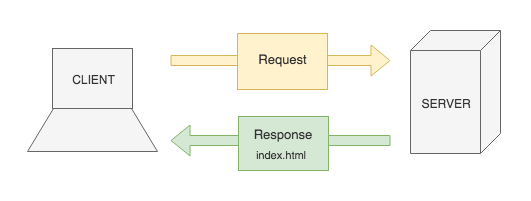

# Intro to JavaScript and Node.js

**Lesson duration: 30 minutes**

### Learning Objectives

- Understand what JavaScript is and where it came from
- Know what a JavaScript runtime is
- Understand why Node is useful

## Intro

In this module we will learn JavaScript as a programming language. JavaScript was originally designed as a front-end tool to make web pages more interesting, but that isn't all that it can do. JavaScript can be used to build entire web apps, native apps, mobile apps, games as well as a plethora of other things. Almost anything that can be done using other programming languages can be done using JavaScript.

Before we start learning the language, let's take some time to learn what JavaScript is, where it came from and why it's important.

## History of JavaScript

The year is 1995. The internet has been around for a while and is becoming more widely used, but it's still in its infancy. Netscape Navigator is the dominant web browser with over 75% market share. Web pages are constructed using pure HTML. CSS hasn't been created yet.

When a user types a URL into their browser's address bar, the client makes a request to a server. The server then responds by sending back an .html file, which is rendered by the browser.



*Request Response Cycle*

In order to update the information that is displayed in the browser, the client had to make another request to the server and wait for the server to respond with more HTML. Internet connections in the mid 90s were very slow, so this wasn't ideal.

Netscape, realising that the web had to become more dynamic and interactive, recruited Brendan Eich to create a scripting language that would compliment Java, as that was the popular new programming language at the time. This new language was to be embedded in the HTML that was sent to the client, allowing logic to be performed client side without having to make additional requests to the server. It would be revolutionary, allowing web pages to change in real-time.

The language that Brendan Eich created was originally called LiveScript when it was released as part of the Netscape Navigator web browser in 1995, but was renamed JavaScript a few months later. This caused some confusion as people believed that it was somehow related to Java, but the name was purely a marketing ploy as Java was very popular at the time.

### ECMAscript

A year later, in 1996, Netscape submitted JavaScript to ECMA International so that they could create a standard specification which could then be implemented in other web browsers. This led to the release of the official language specification known as ECMAScript or ES1 in 1997.

You'll sometimes hear people refer to JavaScript as ECMAscript (or vice versa) although they're slightly different things. JavaScript is a programming language, whereas ECMAscript is the specification that JavaScript adheres to.

ECMAscript has gone through various iterations over the years since it's initial release in 1997, adding and improving language features with each new release.

### Official ECMAScript releases:

- ES1: June 1997
- ES2: June 1998
- ES3: Dec 1999
- ES4: Targeted for 2008 (abandoned)
- ES5: Dec 2009
- ES2015 (ES6): June 2015
- ES2016 (ES7): June 2016
- ES2017 (ES8): June 2017

ECMAScript releases will be yearly from 2015 onwards so it will become more and more common to see them named by year.

You may also see the term ES.Next. This refers to whatever the next release of JS will be.

## Node.js

As we discussed earlier, JavaScript was originally designed to run client-side, in the browser, to make web pages more dynamic and interactive. The back-end was typically written in another language, like Java, and JavaScript was sent to the client with the HTML.

All major internet browsers have a JavaScript runtime, an environment in which they can execute JavaScript code. Google Chrome has its V8 engine and Safari has WebKit, for example.

Node.js is a JavaScript runtime which was built on Chrome's V8 JavaScript engine. Node provides a JavaScript environment outside of the browser, where we can run server-side code. With the help of Node, JavaScript has gained traction as a full-stack programming language. This means that we can write entire applications using only JavaScript, HTML and CSS.

## Writing Our First JS App

We're going to create our first JavaScript app and run it in the command-line using Node.

Before we get started we'll have to check that we have Node installed on our machines. Typing `node -v` into the command-line should yield a version number, not a 'command not found' error.

```sh
node -v

# -> vx.x.x
```

The first thing that we'll have to do is create a file to work in. We're going to write a simple 'hello world' program, so we'll name our file hello_world.js.

```sh
touch hello_world.js
```

> .js is the file extension used for JavaScript files.

There is no hard and fast rule when it comes to naming JS files. The most common naming conventions are snake_case, kebab-case or camelCase. None of these are considered to be better practice than the others, but it is bad practice to mix and match. Pick the one that you like best and be consistant throughout your project.

```js
// hello_world.js

console.log('Hello, World!');
```

> The correct naming convention for variables and functions in JavaScript is camelCase.

Now that we've written some JS, we can use Node to run it.

```sh
node hello_world.js
```

...And just like that, we're JavaScript developers! Well, almost... We're at the beginning of our journey towards becoming JavaScript developers.

## Recap

What effect did JavaScript have on web development?

<details>
<summary>Answer</summary>
JavaScript allowed developers to make web pages that were more dynamic and interactive.
</details>

<br>

What is Node.js?

<details>
<summary>Answer</summary>
Node.js is a JavaScript runtime which allows us to run JavaScript code outside of an internet browser.
</details>

## Conclusion

Now that we know a little bit about what JavaScript is and where it came from we're ready to start learning the language. We'll spend the next few weeks learning JavaScript as a programming language, writing JavaScript that runs in the browser, allowing us to create more interesting, dynamic and interactive web pages, and writing server-side JavaScript to handle routing and database queries.
