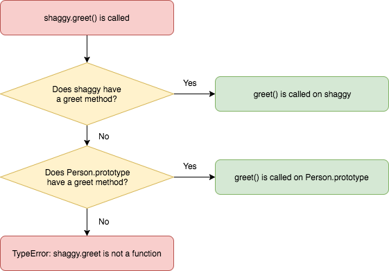

# Constructor Functions & Prototype Objects

**Lesson Duration: 90 minutes**

### Learning Objectives
- Understand how the `new` operator works
- Be able to create objects using constructor functions
- Understand the benefits of attaching functions to a prototype
- Be able to attach functions to an object's prototype
- Be able to `require` one module into another

## Intro

We've learned about the basic JavaScript language features, now it's time to start putting them all together and considering how we might use them to structure an application.

Classes are the building blocks that we use to construct applications in object-oriented programming, so learning how to create them in JavaScript is the next logical step.

JavaScript is an object based language, but it isn't strictly object-oriented like Ruby, Java or a lot of other languages. That doesn't prevent us from applying the OO design principles that we know and love.

## "Classes" in JavaScript

Strictly speaking there is no class construct in JavaScript, although we can achieve something very similar using the constructor function pattern.

Constructor functions might look and behave slightly differently to a traditional class, but they allow us to achieve the same goal: creating objects.

## Constructor Function Notation

Let's imagine that we want to create a `Person` object to model Shaggy. We can use a constructor function to achieve this in the same way that we might use a class in another language:

```bash
touch person.js
```

```js
// person.js

const Person = function () {

}

const shaggy = Person();
console.log('shaggy:', shaggy);
// -> shaggy: undefined
```

> The correct naming convention for constructor functions is PascalCase / UpperCamelCase.

A constructor function is just like any other function. Seeing as we are not returning anything from our function, the return value of the `Person` function will be `undefined`. As a result the value of `shaggy` is `undefined`.

## The `new` Operator

If we add a `new` operator before our function call, its behaviour changes. Instead of returning `undefined`, it will return an empty `Person` object.

```js
const Person = function () {

}

const shaggy = new Person(); // MODIFIED
console.log('shaggy:', shaggy);
// -> shaggy: Person {}
```

`shaggy` knows that it was created using the `Person` constructor.

> Instructor note: Ask the students not to code along here

If we were to manually return an object from the function, then we would get back a plain object instead. It wouldn't know that it was created using the `Person` constructor.

```js
const Person = function () {
  return { name: 'Shaggy Rogers' }; // NEW
}

const shaggy = new Person();
console.log('shaggy:', shaggy);
// -> shaggy: { name: 'Shaggy Rogers' }
```

The `new` operator is now ignored and the value of `shaggy` is the plain object that we returned. It doesn't even know that it was created via the `Person` constructor function.

This isn't what we want...

The key thing to remember is that we never explicitly return anything from a constructor function because it prevents the `new` operator from working properly.

## Adding Properties to Objects

We can give objects properties (also known as attributes) to store information about them (their state). Let's give our person a name property with a `String` value.

To do this we will need to access and modify the `Person` object as it's being constructed. How can we do that?

In JavaScript there is a special keyword that we can use to refer to the object that we're currently creating from inside our constructor function: `this`.

```js
const Person = function () {
  console.log('this:', this); // MODIFIED
  // -> this: Person {}
}

const shaggy = new Person();
console.log('shaggy:', shaggy);
// -> shaggy: Person {}
```

They're the same object! `this` refers to whichever `Person` we're creating at the time.

### Task: (10 minutes)

- Add a name property with the value `'Shaggy Rogers'` to the object that is returned from our constructor
- `console.log` only `shaggy`'s name property instead of the entire object

<details>
<summary>Example solution</summary>

```js
const Person = function () {
  this.name = 'Shaggy Rogers'; // MODIFIED
}

const shaggy = new Person();
console.log('name:', shaggy.name); // MODIFIED
// -> name: Shaggy Rogers
```

</details>

<br>
  
Notice that we're able to access `shaggy`'s name property directly. There are no access modifiers in JavaScript. There are ways to encapsulate data, effectively mimicking the `private` access modifier that you may have encountered when working with other languages, but this is a fairly advanced topic in JavaScript.

If a property should share the same initial value across all instances, we can hard code the value in the constructor as we did here with `name`.

People have different names, so in this case we should pass the value in to our constructor function as an argument to make our code more versatile or dynamic:

```js
const Person = function (name) { // MODIFIED
  this.name = name; // MODIFIED
}

const shaggy = new Person('Shaggy Rogers'); // MODIFIED
```

Now we can pass in a name when we create a `Person` object and as a result different people can have different names.

## Adding Methods To Objects

Due to the fact that functions are objects that can be stored in variables in JavaScript, we can attach methods to our objects in exactly the same way that we attach properties.

To do this we can use the `this` keyword, give our method a name and then assign an anonymous function as it's value. We can then access the method using the dot (`.`) notation, just like we would if we were accessing a property, and invoke the method by adding brackets (`()`) for our argument list.

```js
const Person = function (name) {
  this.name = name;
	
  this.greet = function () { // NEW
    console.log(`Hi! My name is ${ this.name }`);
  }
}

const shaggy = new Person('Shaggy Rogers');
shaggy.greet(); // NEW
// -> Hi! My name is Shaggy Rogers
```

> We can use the `this` keyword to refer to the object that is calling our method too; in this case `shaggy`. This is called the context.

Now our object has some behaviour!

If we create another object using the `Person` constructor, it will also have an identical `greet` function attached to it.

```js
const velma = new Person('Velma Dinkley');
velma.greet();
// -> Hi! My name is Velma Dinkley
```

We can also access the method on this new object, which is awesome, but there's a better way to do this. We are essentially creating multiple identical copies of the `greet` method and attaching one to every instance.

```js
console.log('shaggy:', shaggy);
console.log('velma:', velma);

// -> shaggy: { name: 'Shaggy Rogers', greet: [Function] } 
// -> velma: { name: 'Velma Dinkley', greet: [Function] } 
```

> Instructor note: Ask the class...

Can you think of any disadvantages of storing the same method on multiple objects?

<details>
<summary>Answer</summary>

- Multiple versions of the exact same function object stored in memory

</details>

## Prototypes

Instead of adding methods in our constructor function, we can add our methods to the constructor's prototype object.

### What is a Prototype Object?

Before we learn about prototype objects in JavaScript, let's think about what the word prototype means in English.

The Oxford English Dictionary defines a prototype as:

*"A first or preliminary version of a device or vehicle from which other forms are developed."*

In JavaScript a prototype object acts as a central store of information which all objects created via a particular constructor function can access.

### How do we do this?

When we create objects using a constructor function with the `new` operator, the constructor's prototype object is assigned to it. Prototype objects are just objects with key-value pairs, like any other in JavaScript.

Let's access the `Person` object `prototype` and add a greet method to it.

```js
const Person = function (name) {
  this.name = name;
}

Person.prototype.greet = function () { // NEW
  console.log(`Hi! My name is ${ this.name }`);
}
```

We created a new key, `greet`, within the `Person` constructors prototype object and assigned a function as its value.

This method will now be stored only on the shared prototype object, instead of each `Person` instance.

```js
const shaggy = new Person('Shaggy Rogers');
shaggy.greet();
// -> Hi! My Name is Shaggy Rogers

const velma = new Person('Velma Dinkley');
velma.greet();
// -> Hi! My Name is Velma Dinkley

console.log('shaggy:', shaggy);
console.log('velma:', velma);
// -> shaggy: { name: 'Shaggy Rogers' }
// -> velma: { name: 'Velma Dinkley' }
```

Notice that the `greet` function is no longer attached to each object, but they still have access to the method.

We can see these object's prototypes using `Object.getPrototypeOf`.

```js
console.log("shaggy's prototype:", Object.getPrototypeOf(shaggy));
console.log("velma's prototype:", Object.getPrototypeOf(velma));
```

### How does this work?

If we try to call a method on an object, JavaScript first will check if the method exists on the object itself. If it doesn't find it then it will check the object's prototype.

Therefore when we call `greet()` on `shaggy`, JavaScript will first look for that method on `shaggy`. It won't find it there so JavaScript will check the `Person` prototype and find it there. If the method was not found on the prototype object then JavaScript would conclude that `shaggy.greet` is not a function.



*Calling a Method That is Defined on a Prototype Object*

> It is possible to create a prototypal inheritance chain but, like multiple inheritance in other languages, it is usually best to avoid it.

### Why do we do this?

Storing methods on a prototype, instead of the objects themselves, is more memory efficient. When we do this only one copy of each method exists in memory. If we were to store a copy of every method on every object that we created, then we would be using additional memory to store multiple copies of the exact same function.

### Task: (15 minutes)

1. Create a new file - pet.js
2. Create a Pet constructor
3. Assign values to the following properties in your Pet constructor via parameters:
	- name
	- species
4. Add an eat method to your `Pet`'s prototype. This method should accept a `food` parameter and output a string containing the `name` property and the `food` that was eaten. For example: `'Scooby Doo ate a Scooby Snack'`.

<details>
<summary>Example solution</summary>

```bash
touch pet.js
```

```js
// pet.js

const Pet = function (name, species) {
  this.name = name;
  this.species = species;
}

Pet.prototype.eat = function (food) {
  console.log(`${ this.name } ate a ${ food }`);
}

const scooby = new Pet('Scooby Doo', 'Dog');
scooby.eat('Scooby Snack');
```

</details>

## Requiring and Exporting Modules

This is great so far. We can do just about anything that we could do with a class in another language. Now only one thing remains...

Let's get our objects speaking to each other!

> Note: Remove everything apart from the constructor functions and prototype methods from each file

First we'll create another file:

```bash
touch app.js
```

This will be the entry point into our application where we will create objects using our constructors.

To do that we will need to `require` the constructors from the other files:

```js
// app.js

const Pet = require('./pet.js');
const Person = require('./person.js');
```

> The .js file extensions are optional when using `require`.

We're using UpperCamelCase for `Person` and `Pet` here because we're importing the constructor functions and storing them in variables.

Now that we have imported our constructors, let's create an instance of `Pet` and `Person` and access their methods:

```js
// app.js

const scooby = new Pet('Scooby Doo', 'Dog');
scooby.eat('Scooby Snack');

const shaggy = new Person('Shaggy Rogers');
shaggy.greet();
```

We aren't done just yet. If we run app.js now we should hit an error.

```bash
node app.js
# -> TypeError: Pet is not a constructor
```

`Pet` is not a constructor. We didn't tell JavaScript what we would like to export from each file, so we just got back empty objects.

Let's tell JavaScript which objects we actually want to export from each file:

```js
// person.js

module.exports = Person;
```

```js
// pet.js

module.exports = Pet;
```

In this case we want to export our constructor functions.

We can think of `require` as a function that looks at whichever file we tell it to and gives us back the value of `module.exports` for that file.

### Task: (15 minutes)

- Assign a pet property in the `Person` constructor via a parameter
- Add a `feedPet` method to `Person.prototype` which:
	- Accepts a `food` parameter
	- Outputs a string containing the person and pet's names and the food. For example: `'Shaggy Rogers fed Scooby Doo a Scooby Snack'`
	- Invokes the pet's `eat` method and passes the `food` to it

<details>
<summary>Example solution</summary>

```js
// person.js

const Person = function (name, pet) { // UPDATED
  this.name = name;
  this.pet = pet; // NEW
}

Person.prototype.greet = function () {
  console.log(`Hi! My name is ${ this.name }`);
}

Person.prototype.feedPet = function (food) { // NEW
  const message = `${ this.name } fed ${ this.pet.name } a ${ food }`;
  console.log(message);
  this.pet.eat(food);
}
```

```js
// app.js

const scooby = new Pet('Scooby Doo', 'Dog');
const shaggy = new Person('Shaggy Rogers', scooby); // UPDATED

shaggy.greet();
shaggy.feedPet('Scooby Snack');
// -> Hi! My name is Shaggy Rogers
// -> Shaggy Rogers fed Scooby Doo a Scooby Snack
// -> Scooby Doo ate a Scooby Snack
```

</details>

## Recap

> Instructor note: Ask the class...

Step by step: what happens when we invoke a function using the `new` operator?

<details>
<summary>Answer:</summary>

- An object is created within the constructor
- JavaScript assigns the constructor functions prototype to that object
- We assign properties to the object
- The object is returned from the constructor function

</details>

<br>


Which keyword can we use to refer to an object inside its constructor?

<details>
<summary>Answer:</summary>

`this`

</details>

<br>

What is the main advantage of storing methods on a prototype object?

<details>
<summary>Answer:</summary>

- Memory efficiency

</details>

## Conclusion

Now we can use constructor functions to create objects with a similar set of properties and prototype objects to store methods for them.

This allows us to write much more DRY (Don't Repeat Yourself) code than if we were to manually create these objects, as well as allowing us to ensure that all of objects of a similar type have the same set of properties and behaviours.
