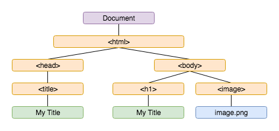
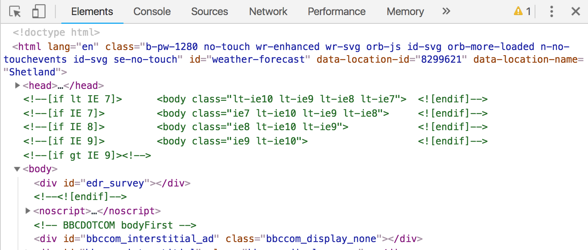
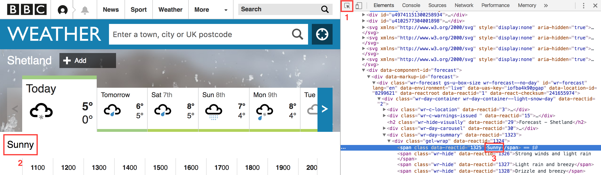
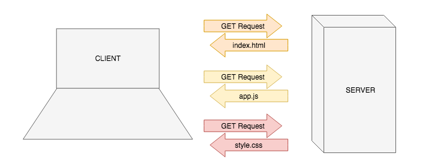

# The Document Object Model

**Lesson Duration: 90 minutes**

## Learning Objectives

- Know what the DOM is
- Understand what the DOM allows us to do
- Understand what the `window` and `document` objects are
- Understand the purpose of Chrome Dev Tools Console
- Be able to use Chrome Dev Tools Elements to investigate the current state of the DOM
- Be able to query the DOM
- Be able to modify existing DOM elements
- Be able to create DOM elements
- Be able to insert elements into the DOM

## Intro

In today's world, JavaScript is used everywhere; to write desktop and mobile applications, to automate behaviours in software (such as Adobe PhotoShop or Google Sheets), on servers, in hardware, and even to give instructions to robots!

In this lesson we're going look at JavaScript in the environment for which it was written, the web browser. We are also going to look at some of the tools we can use to debug our applications when working in the browser.

JavaScript enables us to create dynamic, interactive web applications that feel more like native software than websites. This is achieved by using JavaScript to update the page in real-time, rather than making additional requests to a server for new information. The DOM is the browser's interface to developers, and it allows us to do just that.

## About the DOM

The Document Object Model (DOM) consists of of the following:

### 1. A node-tree

The DOM's node-tree is a representation of all the elements that make up the current page.



_DOM node-tree_

When the browser receives HTML in response to an HTTP request, it parses the HTML and creates the node-tree, which is the browser's representation of the HTML that has been written.

### 2. Methods and properties

The DOM provides us with methods and properties that allow us to manipulate the node-tree and handle interaction using JavaScript.

The DOM allows us to change the structure, style, and content of a web page using JavaScript. These changes could include:

- modifying the data being displayed
- changing the styling of an element
- adding behaviour in response to events
- creating and displaying new elements

These changes can be made in response to events, for example, user interaction or when new data received.

> Open [BBC Weather](https://www.bbc.co.uk/weather/0/8299621) in Google Chrome

On the BBC weather website, if we:

1. select a day of the week by clicking on a tab
2. click on an hour of the day to see more detail

we can see that JavaScript is being used to:

- change the css to increase the tab size
- update the data to the selected day's weather
- create and display the expandable detail section

## Inspecting the DOM

Most web browsers come with a built-in DOM viewer. We're going to take a closer look at Google Chrome's in the devtools.

To open up the devtools, we can either right-click on the page and choose `Inspect`, or we can use the keyboard shortcut `cmd + shift + C`.

In the `Elements` tab we can see the DOM's node-tree, with all the elements that make up the page. It has a `<head>` and `<body>` sections, with `<div>`s that have IDs and classes.



_Elements tab in devtools displaying the DOM's node-tree of page elements_

## Manipulating the DOM

We can update the DOM directly in the devtools.

1. Click on the select tool which enables us to to select an element from the page.
2. Click on a element on the page, which focusses the element in the devtools.
3. Change the text in the devtools. When we hit enter, the page is updated.



_Manipulating the DOM in the devtools_

It is important to understand that the DOM is not always the same as the HTML. The DOM is initially a representation of the HTML because the DOM is created by parsing the HTML, but once this process is complete, the DOM may be manipulated by JavaScript, at which point it differs from the HTML.

In the case of the BBC weather web page, we updated the DOM in devtools, but this only changed what the browser displays, not the HTML or CSS files themselves. The DOM viewer allows us to see the current state of the page.

Updating the DOM in the devtools in a neat party-trick, but usually we'd interact with the DOM programmatically, using JavaScript. Let's look at how we would go about that.

### Manipulating the DOM with JavaScript in the Console

> Instructor note: Hand out the start point

To run the start point, open index.html in the browser. You will see in the devtool's Elements tab that the browser has parsed the HTML to create the DOM, which is being used to display the text, 'Hello World!' in an `<h1>`.

### `window` and `document`

We want to modify the DOM using JavaScript, so how do we do that?

The `window` object represents the browser's window. The `window` object is known as the browser's _global_ object. It is the main context in which our code runs. When we use `console.log`, we're actually using `window.console.log`.

Prior to working in the browser, Node was the environment our code was being run in. In addition to the functionality that the Node global object had, (like `console.log`) the `window` also has information about the browser environment.

We access the DOM via the window, with `window.document`. We can just write `document` however, because `window` is the global scope. The `document` object is the Document Object Model, the DOM.

Open the Console tab of devtools and type `window` and hit enter. This shows us the window object. You will see `window` has a property of the `document` object.

### `document`'s methods

To manipulate the DOM with JavaScript, we can use the `document`'s methods. Let's just update the `h1` that says, "Hello World!" to say, "JavaScript says, Hello World!".

We are going to look at these methods in more detail in the 'DOM Manipulation' section, but for now let's get hold of the title by it's tag type, `h1` by using `querySelector`, which allows us to query the DOM to access its elements.

```js
const title = document.querySelector('h1');
```

Now let's overwrite it using the `textContent` property on the `h1` element.

```js
title.textContent = 'JavaScript says, Hello World!';
```

We have updated the DOM using JavaScript, the page has updated to reflect the new state of the DOM.

### Manipulating the DOM from a JavaScript file

That's great, but we want to write our JavaScript in our web application, not just in the console. How are we going to interact with the DOM using JavaScript written in our .js files?

In index.html's `<head>` there is a script tag that links to a .js file.

```HTML
<script src="js/app.js"></script>
```

When index.html is loaded by the browser, the above script tag tells the browser to make another request for the JavaScript file, app.js. Requests are also made for any other resources defined in `<script>` and `<link>` tags in the index.html's `<head>` tag.



_HTTP Request/Response Cycle_

Once app.js has been loaded by the browser, it has access to the browser's global object, the `window`.

We can confirm that by putting a log in app.js.

```js
// js/app.js

console.log('app loaded', window);
```

When we refresh the page, we now see the window object in the console.

We have the `window` object available to us, and therefore we also have access to the `document` object and all its methods. So let's go ahead and update the title as we did before.

However if we now try to overwrite the title as we did in the console we get an error:

```js
const title = document.querySelector('h1');
title.textContent = 'JavaScript says, Hello World!';
// -> Uncaught TypeError: Cannot set property 'textContent' of null
```

This tells us `title` is `null`. That is because the JavaScript file is being run before the DOM has finished loading, so the `h1` element isn't available at the point `querySelector` is executed. We need to wait until the DOM content has finished loading before executing the code.

### DOMContentLoaded

We want to wait until the DOM has finished loading before executing the code. `addEventListener`, which takes the name of an event and a callback as arguments, will listen for the event to be fired by the browsers, and then execute the callback.

By using `addEventListener`, when the `document`'s `DOMContentLoaded` event fires, we can be guaranteed to have access to the DOM elements. At this point, the DOM is ready to be manipulated.

```js
document.addEventListener('DOMContentLoaded', () => { // NEW
	const title = document.querySelector('h1');
	title.textContent = 'JavaScript says, Hello World!';
});
```

Now we have seen that we can manipulate the DOM from inside our JavaScript applications, let's look in more detail at the document's methods that allow us to make the modifications to the DOM.

## DOM Manipulation

We are going to learn how to do the following:

- Access existing DOM elements in our JavaScript
- Modify the existing DOM elements - e.g. change an element's text / give an element a class.
- Create new DOM elements and display them on the page.

## Accessing DOM Elements

### `querySelector`

To modify an element that is already in the DOM, we first need to access it in our JavaScript.

We've already used the `document` object's [`querySelector`](https://developer.mozilla.org/en-US/docs/Web/API/Document/querySelector) method to access the title (`h1`) from the DOM before we updated its text (`const title = document.querySelector('h1')`). To access the `h1`, we passed `querySelector` a query string, and the `document` returned to us an object representing the `h1` element on our page.

We can use `document.querySelector` to target any single element by querying its ID, class or the tag name unsing the CSS selector syntax:

- An ID selector is prefixed with a `#` - `querySelector('#my-id')`
- A class selector is prefixed with a `.` - `querySelector('.my-class')`
- A tag selector has no prefix - `querySelector('p')`

### Task (5 minutes)

1. Use `document.querySelector` to access the paragraph with the ID 'welcome-paragraph' from the DOM.
2. What is the difference in output when you use `console.log` and `console.dir`?

<details>
<summary>Solution</summary>

```js
document.addEventListener('DOMContentLoaded', () => {
  // ..
  const welcomeParagraph = document.querySelector('#welcome-paragraph');
  console.log(welcomeParagraph);
  // -> <p id="welcome-paragraph">Welcome to my JavaScript DOM site</p>
  console.dir(welcomeParagraph);
  // -> p#welcome-paragraph
});
```

`console.dir` allows us to see all of the element's properties.

</details>

`querySelector` will return only the **first** element on the page matching the specified query. If we look inside the Elements tab in Chrome's dev tools, we can see two elements in our page have the `class` "red", so when we access the element with the class "red", we only get the paragraph element, as it comes before the red list-item in the page.

```js
// ...

const redElement = document.querySelector('.red');
console.log(redElement);
// -> <p class=red>A list:</p>
```

If we wanted to access the list-item (`li`) with the class "red", `querySelector` can be used with combined selector types for increased specificity. Let's access the `li` with the class "red".

```js
// ...

const redListItem = document.querySelector('li.red');
console.dir(redListItem);
// -> li.red
```

Combining queries in this way, we can be specific about the element we want to access.

### `querySelectorAll`

If we want to get back a collection of multiple elements then we can use `querySelectorAll`. Like `querySelector`, this method accepts a CSS selector, but it will always return a collection of all of the elements that match our query. For example, if we wanted to get back all the list items.

```js
// ...

const allRedElements = document.querySelectorAll('li'); // NEW
console.dir(allRedElements); // NEW
// ->
// NodeList(3)
//   0: li.blue
//	 1: li.green
//	 2: li.red
//   length: 3
});
```

`querySelectorAll` returns a [NodeList](https://developer.mozilla.org/en-US/docs/Web/API/NodeList), which is a collection similar to an Array.

> Note: There are other, older methods to access DOM elements, but `querySelector` and `querySelectorAll` do everything these do and more. They are: [`document.getElementById`](https://developer.mozilla.org/en-US/docs/Web/API/Document/getElementById), [`document.getElementsByClassName`](https://developer.mozilla.org/en-US/docs/Web/API/Element/getElementsByClassName) and [`document.getElementsByTagName`](https://developer.mozilla.org/en-US/docs/Web/API/Element/getElementsByTagName)

## Modifying DOM Elements

Now we have accessed existing elements from the DOM. Now we have access to DOM elements, there are many ways in which we can modify them and we are going to look at a couple of them.

### `textContent`

We can the change an element's text value using `textContent`, or change which CSS rules apply to the element by modifying the ID or the classes.

We have seen that we can update the text of an element with `textContent` when we updated the title (`title.textContent = 'JavaScript says, Hello World!'`).

Let's update the text of the list item with the class "red".

```js
const redListItem = document.querySelector('li.red');
redListItem.textContent = 'RED!!'; // NEW
```

If we refresh the page, we can see the text has been updated.

### `Element.classList`

We can also modify a DOM element by adding a new class to it's list of classes. If we look in styles.css we can see we have styles for a class "bold". Let's give our `redListItem` this class, using the `add` method on the element's `classList` object.

```js
const redListItem = document.querySelector('li.red');
redListItem.textContent = 'RED!!';
redListItem.classList.add('bold'); // NEW
console.dir(redListItem);
// -> li.red.bold
```

If we refresh the page and look at the Elements tab in the dev tools, we can see that the list item has a new class.

Note: The `classList` object, attached to all DOM `Element`s has other [methods](https://developer.mozilla.org/en-US/docs/Web/API/Element/classList#Methods), such as `remove` and `toggle`, which all take a string as an argument.

## Creating New DOM Elements

### `document.createElement`

We can also create brand new DOM elements by using [`document.createElement`](https://developer.mozilla.org/en-US/docs/Web/API/Document/createElement).

Let's create a new list item and add it to the list. In style.css we have some styling that targets the class 'purple', so we can create a new list item with the text "purple" and assign it the class "purple".

```js
const newListItem = document.createElement('li'); // NEW
newListItem.textContent = 'Purple'; // NEW
newListItem.classList.add('purple'); // NEW
```

If we refresh the page, we don't see our new element. That's because it only exists as a JavaScript object right now, we still need to actually put it into the DOM. To do this, we need an element which is already in the DOM, that we can append our newly created element to.

## Appending DOM Elements

We want to add our new list item to the list of colours. So first we need to access the list (`ul`), using `querySelector`. Then we can use another of the document's methods - `appendChild` - to add the new list item to the list.

```js
const list = document.querySelector('ul'); // NEW
list.appendChild(newListItem); // NEW
```

If we look inside the Elements tab, we can see that the new list item has been appended to the list. The fact that list items are indented tells us they are the child of the list. Whenever we append one element to another with `appendChild` it creates this parent child relationship.

## Recap

What type of element is returned by `document.querySelector` and is created by `document.createElement`?

<details>
<summary>Answer</summary>

A DOM element, for example an `<h1>`, `<li>` or `<p>`.

</details>
<br>

How can we target an element by its id?

<details>
<summary>Answer</summary>

```js
document.querySelector('#element-id');
```

</details>
<br>

Which property could we set to change the text displayed in an element?

<details>
<summary>Answer</summary>

`textContent`

</details>
<br>

Which four things do we have to do in order to create a DOM element programatically?

<details>
<summary>Answer</summary>

1. Access an element that already exists in the DOM
2. Create a DOM element
3. Prepare the element (add `textContent` or add to the elements `classList`)
4. Attach our new element to the existing element

The last step is the point when we can actually see our new element in the page.

</details>
<br>

How could we create a `<p>` element?

<details>
<summary>Answer</summary>

```js
document.createElement('p');
```

</details>
<br>

Which method might we use to attach an element to another as a child?

<details>
<summary>Answer</summary>

`parent.appendChild(child)`

</details>

### Further Resources

- [Introduction to the DOM](https://developer.mozilla.org/en-US/docs/Web/API/Document_Object_Model/Introduction)
- [The `window` object](https://developer.mozilla.org/en-US/docs/Web/API/Window)
- [Documentation for the console](https://developer.mozilla.org/en-US/docs/Web/API/Console)

### Conclusion

We now know that the DOM is a representation of a web page's HTML elements that is rendered by the browser. We have also seen how we can manipulate the DOM using JavaScript to update what the user sees in real-time, creating dynamic web applications.
