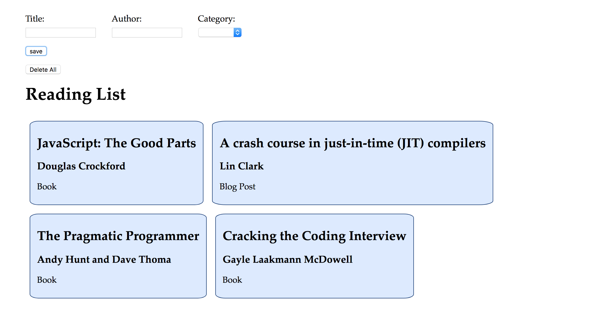

# Events Lab

**Lab Duration: 120 minutes**

### Learning Objectives

- Be able to use a variety of event listener types
- Be able to access values from form inputs on submit
- Be able to attach events to a variety of DOM elements
- Be able to read and write to the DOM

## Brief

Your task is to create a Reading List app that allow a user to submit items they intend to read later and view them on the page. Using the start code, which has the html and css already provided, you will need to handle the form's submission and display the submitted details on the page.

*Screenshot of Example Result*

### MVP

The provided html form has the following fields:

1. Title - text input
2. Author - text input
3. Category (e.g. book, article, blog post) - select

Once the user has submitted the form, the reading list item's details should be displayed below and the form's fields should reset to empty. Each time the user submits the form, the new reading list item should be added to the display.

**Hint: Research `form.reset()`**

### Considerations

When we want to get the values from inputs that are contained within a form, we do that by handling the form's `submit` event, rather than handling the individual input's event separately.

### Planning

1. Add a `script` tag to index.html so that the browser knows to load the JavaScript
2. Add behaviour to the DOM elements' events

### Extensions

1. Add a delete all button, that clears the list of submitted reading list items.
2. Add flexbox layout to the reading list so that items are displayed in a responsive grid.
