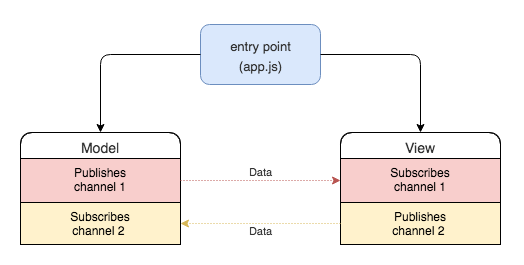
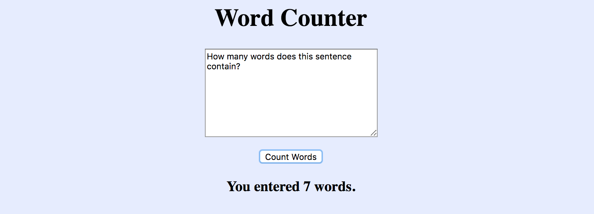
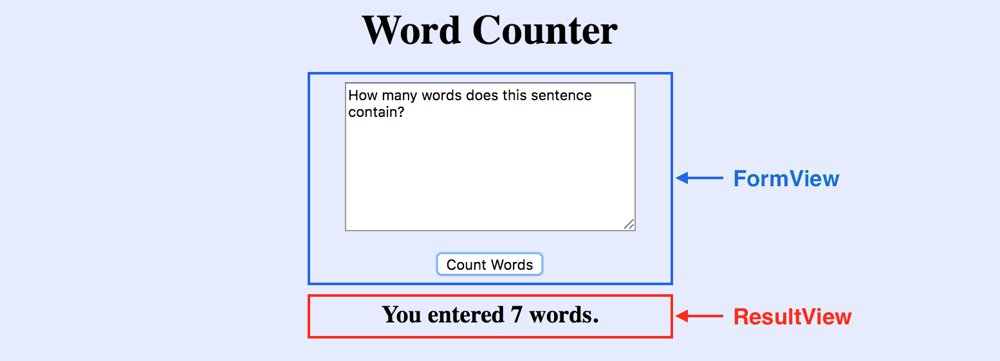
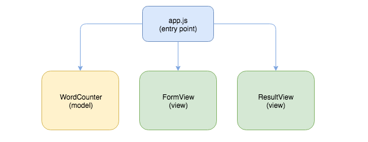
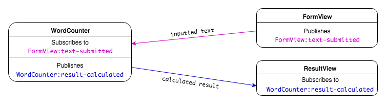

# Intro to the PubSub Pattern

**Lesson Duration: 120 minutes**

### Learning Objectives
- Understand the benefits of breaking up a front-end app into modules / components
- Be able to implement the Publish/Subscribe design pattern
- Be able to build a modular front end

## Intro

As programmers, we want to create well-structured applications so that they are maintainable and extensible. This is something that an architectural pattern can help us do. An architectural pattern informs our decision making around directory and file structure, and the responsibilities of the application's components.

In this lesson we are going to look at one pattern that we can use in our front-end JavaScript applications, the publish-subscribe pattern (pub/sub).

### Single-Page-Applications (SPAs)

Dynamic JavaScript applications often only have one route that the browser uses to make an initial request. This request loads the HTML and other resources including the JavaScript files into the browser. The JavaScript is then used to handle the user interaction, dynamically updating what is rendered to the page in real-time. This replaces the traditional request-response cycle.

A JavaScript application with one route that dynamically renders the page's content is called a Single-Page-Application (SPA). Popular architectural patterns, such as MVC (Model View Controller) are not so applicable to SPAs, because of the lack of a need for controllers that define a set of routes.

### Publish-Subscribe Pattern

If we don't have controllers that are responsible for communicating between the views and models, listening for user interactions and responding with the relevant data, how can we prevent our models and views becoming tightly-coupled (where they are dependent on one another)? To solve this problem we are going to use the publish-subscribe pattern (pub/sub), which is a messaging pattern that allows us to publish data from one part of the application and receive it in another.

In order to understand the pub/sub pattern, let's use the analogy of a radio station and a radio. The radio station broadcasts its content on a certain channel. If you want to listen to the content, you tune your radio to that channel. The pub/sub pattern works just like this. Components can subscribe to a channel and wait for content to be published. Other components can then publish to that channel, sending data to the subscribers.



*Diagram of Pub/Sub pattern, where views and models communicate by publishing on and subscribing to channels*

The pub/sub pattern lets us write loosely coupled components because models and views publish on and subscribe to channels rather than being dependent on each other to communicate. This helps makes our application extensible and maintainable.

## Word Counter

We are going to build an application that allows a user to input some text and see how many words they entered.



*Screenshot of the Word Counter application that we are going to build*

### Views

We could write all the view logic in one file, but as our applications grow in complexity, it is helpful to handle sections of the view with separate view files. This modularisation of the front-end will make our code easier to maintain and extend.

We are going to have a view to handle each dynamic section of the UI: one to handle the user's input and the other to display the resulting message.



*Word Counter Application's Views*

### Models

We are going to have one model that counts the number of words submitted by the user.

### Application Architecture



*Application Architecture of Word Counter*

- app.js is going to be the entry point to the application where all the event listeners are initialised on DOMContentLoaded.
- `FormView` will listen for text submitted by the user.
- `WordCounter` model will be responsible for calculating the number of words and returning a result.
- `ResultView` be responsible for rendering the resulting message to the page.

But how will the inputted text get passed from the FormView to the WordCounter model? And how will the model pass the calculated result to the ResultView? Pub/Sub helps us solves this problem.

The FormView will publish the inputted text on a channel that the WordCounter model will subscribe to, to receive the text. Then the WordCounter model will publish the calculated result on a channel that the FormView will subscribe to, to receive the result.



*Diagram of data flow through Word Counter application using pub/sub*

## Creating the Application

> Instructor Note: hand out start point

We can see from looking at the package.json we have already installed and configured Webpack, so we can run the start code with:

```sh
npm install
npm run build
open public/index.html
```

Check that you can see the HTML rendering in the browser and that there is a log in the console telling us the JavaScript has loaded.

If we look at the start point we can see we have:
- index.html with the structure of the page, including the form and the result element that will be updated by the JavaScript
- app.js as the entry point for the application where we handle the DOMContentLoaded event
- directories for our models and views with the empty files already created

### Handling the Text Input with FormView

Let's start by creating the FormView that handles the user submitting the text, as this will be the event that triggers the application's data flow.

```js
// form_view.js

const FormView = function () { // NEW

};

module.exports = FormView;
```

The responsibility of the FormView is going to be to handle the user submitting text. To do this we are going to add behaviour to the form's `submit` event. We will do this in a method, which we are going to call `bindEvents` because it will be responsible for setting up the listener for the `submit` event. Let's start by accessing the form, which has an ID of 'wordcounter-form' from the DOM.

```js
const FormView = function () {

};

FormView.prototype.bindEvents = function () { // NEW
  const form = document.querySelector('#wordcounter-form');
};
```

Next we will listen for the `submit` event by adding an event listener to the form. Inside the callback we will:
1. prevent the event's default behaviour because we don't want to make a request
2. access the text input using its ID (which we can see from the index.html is 'text') and access its value
3. log the value of the text input

```js
FormView.prototype.bindEvents = function () {
  const form = document.querySelector('#wordcounter-form');
  form.addEventListener('submit', (event) => { // NEW
    event.preventDefault();
    const inputtedText = event.target.text.value;
    console.log('inputted text:', inputtedText);
  });
};
```

If we refresh the browser, will we see the log when the user submits the form? No, because we haven't called `bindEvents` anywhere, so the behaviour hasn't yet been added to the form's `submit` event.

### app.js

app.js is the entry point to the application, this is where we need to setup all the listeners when the DOM's content is loaded. You can think of app.js as initialised the application, getting everything ready for the user to interact with it.

Let's instantiate our FormView and call its `bindEvents` method to add the behaviour to the form's 'submit' event.

```js
const FormView = require('./views/form_view.js'); // NEW

document.addEventListener('DOMContentLoaded', () => {
  const formView = new FormView(); // MODIFIED
  formView.bindEvents(); // NEW
});
```

Now when we refresh the browser, enter some text and submit the form, we see the output in the console. We now know we have access to the inputted text in FormView.

### WordCounter Model

Next we will write the method that does the calculation as to how many words have been submitted. This calculation is the business logic of the application, so we want to do this in a model. (Views should only be responsible for the rendering of the page.)

```js
// models/word_counter.js

const WordCounter = function() { // NEW

};

module.exports = WordCounter;
```

The method will take in the users inputted text and return the number of words the text contains. We will use the String's `split` method that allows us to tell it what character we want to split on, and returns an array containing the individual elements. In our case we want to split on empty characters, so will pass the `split` method `" "` as an argument, because this will give us an array of the individual words. We can then use the Array's `length` property to get the number of words and return the result.

```js
const WordCounter = function() {

};

WordCounter.prototype.countWords = function (text) { // NEW
  const words = text.split(' ');
  return words.length;
};
```

### ResultView

The last view is the `ResultView` that is going to be responsible for taking the result from the model, and rendering the message to the page.

```js
// result_view.js

const ResultView = function () { // NEW

};

module.exports = ResultView;
```

Let's write the method that takes in a result and displays a sentence to the page. We can call this method `displayResult`. It is going to get the result from the `WordCounter` model's `countWords` method, which we know is going to be a number. We will use this result to update the page with a message. To do this, we first need to access the DOM element with the ID of 'result' that is defined in the index.html.

```js
const ResultView = function () {

};

ResultView.prototype.displayResult = function (result) { // NEW
  const resultElement = document.querySelector('#result');
  resultElement.textContent = `You entered ${result} words.`;
};
```

## Publishing and Subscribing

Ok, so we have the inputted text in the `FormView`, we have the method to do the calculation in the model `WordCounter`, and we have the method to render the result to the page in `ResultView`. But how do we get the inputted text from `FormView` to the `WordCounter`? And how do we get the calculated result from `WordCounter` to `ResultView`. This is where the pub/sub pattern will help us:

1. `FormView` is going to publish the text on a channel and `WordCounter` is going to subscribe to that channel, in order to listen for the published text.
2. `WordCounter` is going to publish the result on another channel and `ResultView` is going to subscribe to the channel to listen for the published result.

### PubSub Helper

So we know we are going to be publishing and subscribing multiple times in the application, therefore it makes sense to create some helper functions, which we can use each time. The PubSub helper is going to be an object that has two functions:

1. `publish` is going to be used to publish data on a channel
2. `subscribe` is going to be used to subscribe to channels in order to receive the data that has been published

```js
// helpers/pub_sub.js

const PubSub = {
	publish: function() {

	},
	subscribe: function() {

	}
};

module.exports = PubSub;
```

## Custom Events

The mechanism we are going to use to do the publishing and subscribing is [Custom Events](https://developer.mozilla.org/en-US/docs/Web/API/CustomEvent).

We have already been using events to send messages in our front-end JavaScript apps, but rather than using an element's predefined events (such as button's `click` event, or a form's `submit` event), we are going to create our own events using the browser's `CustomEvent`s to send data from one component to another.

### `publish`

We are going to start by writing the `publish` method, that will be used by components to publish data out to the rest of the application. It will take two arguments:

1. `channel` - The name of the channel we want to publish on.
2. `payload` - The data we want to publish.

The `publish` method will create a custom event, telling it the name of the event, and giving it the data to attach to the event. The CustomEvent constructor takes the data we want to send in an object with the key `detail`.

```js
const PubSub = {
	publish: function(channel, payload){ // MODIFIED
		const event = new CustomEvent(channel, { // NEW
			detail: payload
		});
	},

	// ..
};
```

The method will also be responsible for dispatching the event.

```js
const PubSub = {
	publish: function(channel, payload){
		const event = new CustomEvent(channel, {
			detail: payload
		});
		document.dispatchEvent(event); // NEW
	},

	// ..
};
```

### `subscribe`

The PubSub's `subscribe` function will be used to handle the subscribing in our application. `subscribe` is going to take in the name of channel (custom event) to subscribe to, and a callback to execute when the event is dispatched. Adding an event listener to a custom event is exactly the same as adding an event listener to elements' predefined events (a button's 'click' and a form's 'submit') but instead of listening for a predefined event name, we use the name of the custom event and we add the event listener to the `document` object.

```js
// pub_sub.js

const PubSub = {
	// ...

	subscribe: function(channel, callback){ // MODIFIED
		document.addEventListener(channel, callback); // NEW
	}
};
```

Now we have our PubSub helper object that we can use throughout our application.

While we are still learning the pub/sub pattern it's helpful to have some output when publishing and subscribing so let's add two logs to those methods that will visualise the order of events.

```js
const PubSub = {
	publish: function(channel, payload){
		console.log(`published on channel: ${channel}. payload: ${payload}`); // NEW
		const event = new CustomEvent(channel, {
			detail: payload
		});
		document.dispatchEvent(event);
	},

	subscribe: function(channel, callback){
		console.log(`subscribed to channel: ${channel}`); // NEW
		document.addEventListener(channel, callback);
	}
};
```

Now we will have visual output as we add the publishes and subscribes to our application.

### Publishing in FormView

So we know we want to send the inputted text from FormView to the WordCounter model. We will start having FormView publish it out on a channel. Let's make use of the `PubSub.publish`. We will require in the PubSub helper object.

```js
// form_view.js

const PubSub = require('../helpers/pub_sub.js'); // NEW
```

When the 'submit' event is triggered, we will publish the inputted text by calling the publish method passing it two arguments:

1. The name of the channel we want to publish on - `'FormView:text-submitted'`
2. The data we want to publish - `inputtedText`

```js
FormView.prototype.bindEvents = function () {
  const form = document.querySelector('#wordcounter-form');
  form.addEventListener('submit', (event) => {
    const inputtedText = event.target.value;
    PubSub.publish('FormView:text-submitted', inputtedText); // MODIFIED
  });
};
```

Now when we refresh the browser, enter some text and click submit, we can see in the console that the text has been published on the channel 'FormView:text-submitted'.

### Channel Naming

The name of the channel (custom event) can be anything, but we are using the name of the component doing the publishing, followed by the name of the event. This will enable us to more easily trace the data flow around the application, because when we subscribe to a channel, we will see where the data has been published from.

### Subscribing in WordCounter

Next we want the WordCounter model to subscribe to the FormView's `'FormView:text-submitted'` channel so that WordCounter can receive the inputted text being published by the FormView. Again, because we are setting up a listener, we are going to do it in a method call `bindEvents`.

```js
// word_counter.js

const WordCounter = function() {

};

WordCounter.prototype.bindEvents = function () { // NEW

};
```

We are going to subscribe to the FormView, so that when FormView publishes the inputted text, WordCounter can access it. We are going to be using the PubSub helper object, so we need to require it and call its `subscribe` function.

```js
const PubSub = require('../helpers/pub_sub.js'); // NEW

const WordCounter = function() {

};

WordCounter.prototype.bindEvents = function () {
  PubSub.subscribe(); // NEW
};
```

`PubSub.subscribe` takes two arguments. The first is the channel name it is going to listen on, which in this case is 'FormView:text-submitted'. The second argument is the callback we want it to execute when the inputted text is received.

```js
WordCounter.prototype.bindEvents = function () {
  PubSub.subscribe('FormView:text-submitted', () => { // MODIFIED

  });
};
```

Now we need to access the text that was published with the event, so let's create a parameter to access the event object when the event is dispatched.

```js
WordCounter.prototype.bindEvents = function () {
  PubSub.subscribe('FormView:text-submitted', (event) => { // MODIFIED

  });
};
```

Previously we have been using `event.target.value` to get the value inputs. With custom events we attach the data being published on the key `detail`, so we access the data published with `event.detail`.

```js
WordCounter.prototype.bindEvents = function () {
  PubSub.subscribe('FormView:text-submitted', (event) => {
    const inputtedText = event.detail; // NEW
    console.log('payload received in WordCounter:', inputtedText); // NEW
  });
};
```

Again, this currently won't have any effect, because we haven't called `WordCounter`'s `bindEvents` anywhere. We set up all listeners in app.js, the entry point to our application. We need to instantiate a model and call its `bindEvents` in app.js.

```js
// app.js

const FormView = require('./views/form_view.js');
const WordCounter = require('./models/word_counter.js'); // NEW

document.addEventListener('DOMContentLoaded', () => {
  const formView = new FormView();
  formView.bindEvents();

  const wordCounter = new WordCounter(); // NEW
  wordCounter.bindEvents(); // NEW
});
```

Great, now when when we click the button, we can see `subscribe` has been called and that the text data has been received in the model! We have just used Pub/Sub to pass data from a view to a model.

### Calculating the Result

The next step is to calculate the number of words that the text contains, using the `countWords` method. We want to do this when WordCounter receives the inputted text from FormView. Let's log the result.

```js
// ...

WordCounter.prototype.bindEvents = function () {
  PubSub.subscribe('FormView:text-submitted', (event) => {
    const inputtedText = event.detail;
    const result = this.countWords(inputtedText); // MODIFIED
    console.log('number of words:', result); // NEW
  });
};
```

Now when we refresh the browser, enter some text and submit the form, we see the result logged in the console.

### Publishing in WordCounter

We now need to get this result from the model to our final view, so let's publish it out on the channel 'WordCounter:result-calculated'.

```js
WordCounter.prototype.bindEvents = function () {
  PubSub.subscribe('FormView:text-submitted', (event) => {
    const inputtedText = event.detail;
    const result = this.countWords(inputtedText);
    PubSub.publish('WordCounter:result-calculated', result); // MODIFIED
  });
};
```

If we refresh the page, enter some text and click submit we can see in the console that the model is publishing the number on the channel, 'WordCounter:result-calculated'. We are now publishing out the result to the application. Next we need to access the result in ResultView by subscribing to the channel, 'WordCounter:result-calculated'.

### Subscribing in ResultView

We are going to subscribe to 'WordCounter:result-calculated' in ResultView. Again, because this is going to be a listener that waits for the publishing of the result, we are going call the method responsible for doing this `bindEvents`. We will log out the result that was attached to the event, with `event.detail`.

```js
// result_view.js

const PubSub = require('../helpers/pub_sub.js'); // NEW

const ResultView = function () {

};

ResultView.prototype.bindEvents = function () { // NEW
  PubSub.subscribe('WordCounter:result-calculated', (event) => { // NEW
    const numberOfWords = event.detail;
    console.log('payload received in ResultView:', numberOfWords);
  });
};
```

And let's call that in app.js on DOMContentLoaded so the listener is ready waiting for the user interaction.

```js
// app.js

const FormView = require('./views/form_view.js');
const WordCounter = require('./models/word_counter.js');
const ResultView = require('./views/result_view.js'); // NEW

document.addEventListener('DOMContentLoaded', () => {
  const formView = new FormView();
  formView.bindEvents();

  const wordCounter = new WordCounter();
  wordCounter.bindEvents();

  const resultView = new ResultView(); // NEW
  resultView.bindEvents(); // NEW
});
```

Now when we refresh the browser, enter some text and submit the form, we see in the console that `subscribe` has been called and ResultView has received the result.

### Displaying the Result in ResultView

Now we can call `displayResult` at the point we receive the result, which will update the page with the message.

```js
// result_view.js

ResultView.prototype.bindEvents = function () {
  PubSub.subscribe('WordCounter:result-calculated', (event) => {
    const numberOfWords = event.detail;
    this.displayResult(numberOfWords); // MODIFIED
  });
};
```

And now when we refresh the page, we should see the resulting message being rendered to the page.

We have successfully built an application with models and views, using PubSub to pass data around the application.

## Namespaces

When choosing names for your custom events, you should make sure that there is no possibility of a clash with other components.

We have been following the convention: `ComponentName:event-description`. This has the added benefit of making the data flow explicit, because we can see which component the data is coming from when subscribing.

## Viewing all Event Listeners

In the Chrome dev tools Elements tab, there is an Event Listeners tab, which lists the listeners that exist on the page.

## Recap

What can we use to help guide us in thinking about what order to build a pub/sub application?

<details>
<summary>Answer</summary>

Event and data flow. We can start by thinking about what event is going to start the data flow. In this case, it was the user inputting a number. We then passed that number to the model to do the calculation, and lastly rendered the resulting message to the screen.

</details>

What is app.js the responsible for?

<details>
<summary>Answer</summary>

app.js is the entry point for the application. It handles the DOMContentLoaded event, which is where we want to initialise all the event listeners for the application, so that when a user starts to interact with the page, it will be ready to handle the input.

</details>

## Conclusion

We've seen that the publish / subscribe pattern using custom events provides us with a messaging pattern that allows us to send data between components. This has enabled us to write decoupled components. If we wanted to drop our `WordCounter` model into another app, we wouldn't need to do much refactoring to be usable in other contexts.

Reasoning about the data flow can be difficult. Including the component name in the event name helps us trace where data is coming from.
