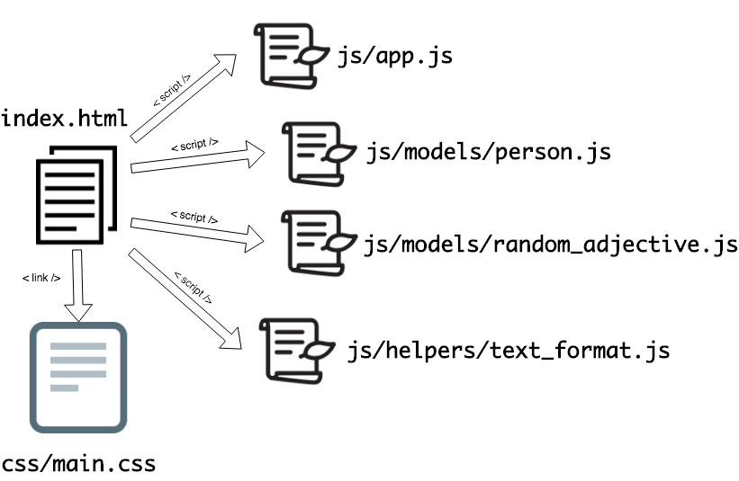
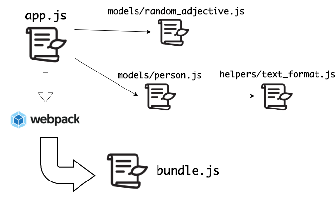
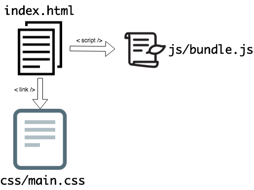
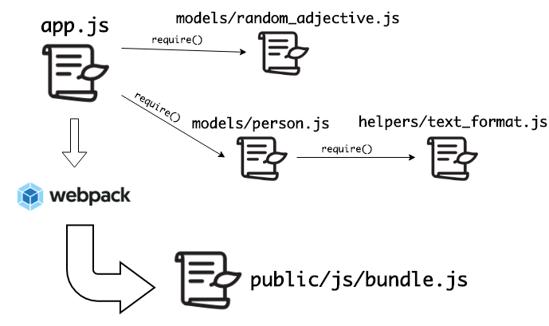

# Module Bundling with webpack

**Lesson Duration: 120 minutes**

### Learning Objectives
- Be able to write a simple webpack config
- Be able to use webpack to generate a bundled script of multiple modules

## Intro

We've seen that we can send JavaScript files, or a module of code, to the browser using `<script>` tag with a `src` attribute set in our HTML file. This is great, we can keep our HTML, CSS, and JS in separate files. Then the `<script>`s and `<link>`s bring them together in the browser to make our site work.

As our JavaScript web applications get larger, however, we'll want to organise our JS code a bit better. We want to put different pieces of code in different files. We want to make re-usable modules to help us avoid repeating ourselves in our code. We might have data `models`, maybe some `helper` functions, or `views` for our UI logic components.

This can get a bit messy and hard to follow. Lots of different files are all depending on one another, all required in our index.html. Module bundlers like webpack allow us to write our code in a more structured way while avoiding the problems that arise when writing larger applications.

## Project Without webpack

> Instructor note: Hand out the start code

This project uses a similar structure to what we've been using so far. It has more JavaScript files, but we don't need to worry too much about exactly what they do. We're just using it to look at some of the issues that module bundlers like webpack help us avoid.

### Multiple Script Tags

Load up the project in the browser and fill in the form. When we submit the form, we should see an error in our devtools console.

```
Uncaught ReferenceError: TextFormat is not defined
```

When we look at where the error is coming from, we can see that our app.js uses the `Person` class from models/person.js, and in the `Person` class, we're expecting an object called `TextFormat` to be defined. We have a dependency on some other code which our app can't seem to find. Why might this be?

Our site only knows about the files we tell it about. In our index.html file, we have some `<script>` tags to tell the browser to make additional requests to load our JavaScript files.



```html
<!-- indexl.html -->
<script src="js/models/person.js"></script>
<script src="js/app.js"></script>
```

If we look at the code in these files, `TextFormat` isn't defined anywhere. `TextFormat` is defined in helpers/text_format.js, so we need to add another `<script>` tag to load this file as well.

```html
<!-- indexl.html -->
<script src="js/helpers/text_format.js"></script> <!-- NEW -->
<script src="js/models/person.js"></script>
<script src="js/app.js"></script>
```

Let's reload the page and try the form again.

```
Uncaught ReferenceError: RandomAdjective is not defined
```
Not again! We've made it further through our code, but now we can't find the `RandomAdjective` class. We forgot another file, models/random_adjective.js. So we have to add that to our index.html as well.

```html
<!-- index.html -->
<script src="js/models/random_adjective.js"></script> <!-- NEW -->
<script src="js/helpers/text_format.js"></script>
<script src="js/models/person.js"></script>
<script src="js/app.js"></script>
```

Now we have all the code we need in our HTML file to make our app work.

This is a real pain. As our application grows and we add more files, we have to keep coming back to include new `<script>`s in our HTML. If we forget one, our app breaks, and not for a particularly good reason, our JavaScript code could be fine, and it still breaks because a dependency is missing.

> This is also problematic because the specific order of our `<script>` tags can matter. They run in the order that they are listed in. It doesn't affect this app, as we don't do anything before the `DOMContentLoaded` event, by which time, all of the scripts have been run. In a different situation this could cause problems. It's something to be aware of, just in case.

### Paired discussion: (5 minutes)

When a class or file uses another class, file, module, function, or library, it is dependent on it. The first module relies on the dependency module. It cannot function without it.

Look through the JavaScript files in our project and draw out the hierarchy of dependencies.

> Instructor note: as the students give these answers, write the dependencies of each file up on the board for use in a later task.

<details>

<summary>Answers</summary>

- app.js depends on models/person.js
- app.js depends on models/random_adjective.js
- models/person.js depends on helpers/text_format.js

- models/text_format.js has no dependencies
- helpers/random_adjective.js has no dependencies. It uses JavaScript's `Math` module, but as this in built-in to the language, it is not considered a dependency.

</details>

<br/>

### Implicit Dependencies

Figuring out the dependencies between files (or modules) in this project is a bit harder than it needs to be. The dependencies between different files are not explicit.

If we see `TextFormat.capitalise` being called in person.js, there is no information in person.js about where that object is supposed to come from. Is it an external library loaded into the page over the internet by a `<script>` tag? Is it another file in our js directory within our project? Is it from an npm package?

This problem only gets worse as we add more and more files to our project.

## Introducing webpack

Using webpack is going to address both of these issues:

- The issue of maintaining a huge list of `<script>` tags to import our code
- The issue of dependencies between modules being implicit, rather than explicit.

Webpack is a module bundler. It takes our source code, in the form of multiple files all nicely split up in a modular, reusable way, and wraps them up into one big "bundle" file. In order for webpack to follow our dependencies between files, we're going to need to make these dependencies explicit. Webpack supports the same syntax that we used in node, `module.exports = myClass` to export from a file, and `require('./path/to/my_file.js')` to import one file into another.



We'll send this bundle of JavaScript code to the user's browser along with our HTML and CSS, instead of sending our JavaScript source code directly.

### Directory Structure

Currently we're sending our whole project directory with all our code to the user's browser. With webpack, we're going to separate our JavaScript source code from the public-facing code that the browser will actually run.

We're going to move our current code into a new directory named "public". This will contain the files that will actually be sent to the user's browser:

- index.html
- main.css
- bundle.js - the bundled up .js file that webpack will generate from our JS source code.

```sh
mkdir public
mv index.html public
mv css public
mkdir public/js
```

Now let's rename our JavaScript source code directory src. This is the conventional name for a directory containing source code.

```sh
mv js src
```

Our new directory structure should look like this:

```sh
.
├── public
│   ├── css
│   │   └── main.css
│   ├── index.html
├── src
│   ├── app.js
│   ├── helpers
│   │   └── text_format.js
│   └── models
│       ├── person.js
│       └── random_adjective.js
```

### Installing webpack

Webpack is a package on npm, which we'll run in node, preparing our files before we send them to the browser environment. We're back in the land of npm and all the amazing libraries that it gives us access to. Before we can install webpack, we need to make our project an npm project.

```sh
npm init -y
```

Now let's install webpack, we also need to install the `webpack-cli` package.

```sh
npm i -D webpack webpack-cli
```

> webpack is a dev-dependency as it's not actually used while our app is running in the browser. As the developers, we use it at build-time, the user doesn't have any webpack code running in their browser. They only need our code in the form of a bundle file created earlier, by webpack.

Let's try it out, by writing and then running an npm script in our package.json.

```json
// package.json
"scripts": {
  "build": "webpack",
  "test": "echo \"Error: no test specified\" && exit 1"
},
```

We can call our npm scripts whatever we like. We're calling this one `"build"`. Because `"build"` is not a built-in npm script name (like `"test"` is), to get npm to find our script we have to tell npm to `run` a script, and then pass the name of the script we want to run.

```sh
npm run build
```

Ah, we've got a couple of warnings and errors here. We need to configure webpack to let it know where our source code is, and where to put our bundled up code.

### Configuring webpack

Webpack looks for a config file called `webpack.config.js` in the root of our project, along with our package.json.

```sh
touch webpack.config.js
```

In this file, we tell webpack a bit about our project's structure, and how we want webpack to work.

Paste this code into the file, and then we'll talk about what each part is doing.

```js
// webpack.config.js

const config = {
  entry: `${__dirname}/src/app.js`,
  output: {
    path: `${__dirname}/public/js`,
    filename: 'bundle.js'
  },
  mode: 'development'
};

module.exports = config;
```
First we create a configuration object and export it from the file. This is so that webpack, running in node, can import our file.

```js

const config = {
//...
};

module.exports = config;
```

We tell webpack where to start looking at our code. What is the "entry point" into our application?

```js
  entry: `${__dirname}/src/app.js`,
```

`__dirname` is a special node variable that tells us the directory of the current file. So in webpack.config.js, it will be something like `/Users/your_username/some/more/directories/module_bundling_with_webpack`.

Also, we need to tell it where to put our code once it's bundled it all up. Where do we want the bundle.js file to go?

```js
  output: {
    path: `${__dirname}/public/js`,
    filename: 'bundle.js'
  },
};
```

For the last option we need to tell webpack whether we're in `'development'` mode or `'production'` mode. Are we working on developing our app, or are we ready to deploy it to our production web server and send it out into the world?

```js
  mode: 'development'
};
```

Webpack has thousands of configuration options and plugins, but this one option will set it up with some sensible default settings for webpack as a development tool. If we set it to `'production'` it would behave differently, optimising the file size for us etc.

Every project that uses webpack will need this config file.

### Running webpack

Now when we run webpack again, we get what we want: A bundle.js file in our public/js directory.

```sh
npm run build
```

## Updating our Project to use the Bundle

This bundle file is automatically generated by webpack, based on our source code in the src directory. This means that the bundle file itself is not important, it can be re-generated at any time by running webpack. We don't want to upload our bundle.js file to `git`, as it's not necessary and will only cause problems. Every commit we would have to re-commit the updated bundle, we'll end up getting conflicts in the bundle file when working with others on a project over github, it'll just be messy. So let's tell git to ignore the bundle.js file.

```sh
touch .gitignore
```

```git
node_modules/
bundle.js
```

### `<script>` Tags

When we run public/index.html in the browser, we should see errors in the devtools console.

```
GET file:///Users/username/path/to/file.js net::ERR_FILE_NOT_FOUND
```

The index.html is still looking for our individual files, and we've moved them. We have to update our `<script>` tags. We can delete all four of our old script tags, and replace them with just one, for bundle.js.

```html
<!-- public/index.html -->
<script src="js/bundle.js"></script> <!-- MODIFIED -->
<!-- DELETED -->
```



Now we won't need to touch our `<script>` tags again.

Let's reload the project in the browser.

### Explicit Dependencies with `require`

We've found our bundle.js file, but when we submit the form again, we see a familiar error.

```
Uncaught ReferenceError: Person is not defined
```

Our old friend "not defined" again. Why was this happening at the start of the lesson? We hadn't included some of our code in the project. Before the reason was missing `<script>` tags.

Now that we're using webpack, the solution is much nicer. Because webpack runs in node, before the code even gets to the browser, we have access to `require` and `module.exports` again 🎉

### Task: 10 minutes

We mapped out the dependencies between the files earlier.

> Instructor note: Recap the dependencies on the board

Using `require` and `module.exports`, you need to make these dependencies explicit so that webpack can bundle all of the necessary code, and our app works again.

**You should not need to modify the code at all, only adding requires and module.exports**

**To run the updated code in the browser, you'll need to run `npm run build` again every time. Changing the source code won't change the bundle file until we re-run webpack.**

Steps:

1. Add a `require` and/or a `module.exports`
2. run `npm run build` in the terminal to create a new bundle.js which reflects your change to the source code
3. Refresh the browser and check the console for errors
4. GOTO 1.

<details>

<summary>Example solution</summary>

```js
// src/app.js
const Person = require('./models/person.js'); // NEW
const RandomAdjective = require('./models/random_adjective.js'); // NEW
// ...
```

```js
// src/models/person.js
const TextFormat = require('../helpers/text_format.js') // NEW
// ...
module.exports = Person; // NEW
```

```js
// src/helpers/text_format.js
// ...
module.exports = TextFormat; // NEW
```

```js
// src/models/text_format.js
// ...
module.exports = RandomAdjective; // NEW
```

</details>

<br/>

Our dependencies are now explicit. We can look at a file, for example person.js, and right at the top we can immediately see all of its dependencies.



### Webpack's Watch Mode

Re-running webpack every time we make changes gets pretty annoying pretty quickly. Thankfully, there's an option to tell webpack to watch our files for changes, and generate a new bundle whenever we save a relevant file.

Let's update our `"build"` script in our package.json to use the `-w` flag (short for "watch")

```json
// package.json
"scripts": {
  "build": "webpack -w", // MODIFIED
  "test": "echo \"Error: no test specified\" && exit 1"
},
```

If we re-run webpack one last time, it will stay running, watching our files for changes. Every time we make a change to our source code, and save our files, webpack builds a new bundle.js.

Try changing the adjectives in src/models/random_adjective.js to test this out. Maybe we want only positive adjectives to describe the colours. When you save the file, check the terminal tab running webpack, and you'll see it's built the bundle again. When we refresh the app in the browser, our changes are reflected in the new bundle file without us having to touch webpack.

## Recap

What problems did webpack solve in this project?

<details>

<summary>Answer</summary>

- Dependencies were implicit, with webpack they're now explicit with `require`s and `module.exports`

</details>

<br/>

How do we run webpack?

<details>

<summary>Answer</summary>

Using an npm script in our package.json, we run `npm run build`, which in turn runs `webpack -w`.

</details>

<br/>

What file to we need at the root of our project to configure webpack?

<details>

<summary>Answer</summary>

webpack.config.js

</details>

<br/>

What does webpack's `-w` option do?

<details>

<summary>Answer</summary>

Watches our files for changes and creates a new bundle.js file whenever we save a change.

</details>

<br/>

## Conclusion

Webpack allows us to structure our front-end code in multiple files and folders more easily. Allowing us to keep our front-end code organised and following sensible patterns and best practices, even as our web-apps grow larger.
