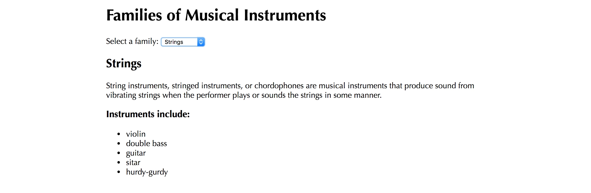

# Pub/Sub Homework: Musical Instrument Families

### Learning Objectives

- Be able to configure and use webpack
- Understand how to pass data between models and views using Pub/Sub
- Be able to use the Pub/Sub pattern to build a modular front-end app

## Brief

Your task is to create an app that allows a user to select an instrument family from a drop-down, and see information about it below.

*Screenshot of resulting application*

Implement the Pub/Sub pattern to separate your presentation and business logic into views and models.

### MVP

- Allow the user to select a musical instrument family from the drop-down and view the family's name and description

### Extensions

- In addition to displaying the name and description of the musical instrument family, also display a list of the musical instruments
- Refactor your view code to implement small methods responsible creating sections of the UI.

## Considerations

What are the responsibilities of the views and models? What is responsible for listening for the click of the menu item? What is responsible for finding the selected instrument family object? What is responsible for deciding how the instrument family details should be rendered?

## Planning

Draw a diagram of your files, detailing the publishing of and subscribing to events and the flow of data through the application.
