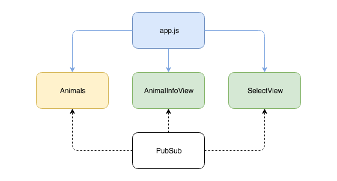
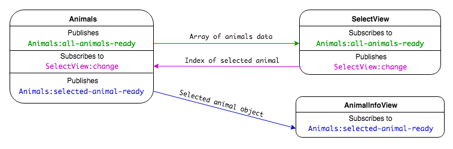
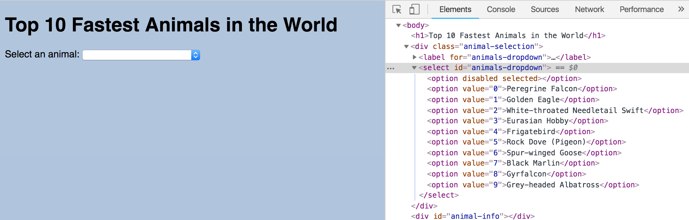

# Recap Modular Front-end with Pub/Sub: Fastest Animals

### Tasks

1. Draw a diagram of the application architecture detailing the views and models.
2. Draw a diagram of the event and data flow through the application, detailing the publishing and subscribing with the data being passed between components.

### Questions

1. What is the model `Animals` responsible for?
2. What is the view `SelectView` responsible for?
3. What does the `SelectView`'s `populate` method do?
4. What is the view `AnimalInfoView` responsible for?
5. What is app.js responsible for?

## Task Solutions

*Application Architecture*

*Application's Event and Data Flow*

## Answers

1. `Animals` is responsible for managing the applications data.
 - It has the array of animal objects, which it publishes out to the application on `'Animals:all-animals-ready'` channel on DOMContentLoaded.
 - It subscribes to `'SelectView:change'` to receive the selected index when a user makes a selection.
 - It uses the selected index to find the corresponding animal object which it then publishes out to the application on `'Animals:selected-animal-ready'`.
2. `SelectView` is responsible for handling the select.
 - It subscribes to `'Animals:all-animals-ready'` and populates the select with the animal data when it receives the data from the model.
 - It handles the select's `change` event, by publishing the selected index when a user makes a selection.
3. `SelectView`'s `populate` method populates the select element.
  - It takes in the animals data
  - It iterates through it and creates an `option` element for each animal in the collection.
  - It sets the `value` and `textContent` of the option element.
  - It appends it to the select.
  

  *Dev Tool's Elements tab shows the Option elements that have been appended to the Select with JavaScript*

4. `AnimalInfoView` is responsible for updating the page with the details of the selected animal.
  - It subscribes to `'Animals:selected-animal-ready'`
  - It displays the information about the animal with it receives the animal object.
5. app.js is the entry point to the application. When the DOMContentLoaded event is fired:
  - It creates the application's components
  - It calls the methods that initialise the event listeners, so that the page is ready for the user to interact with it.
  - **It is important to note that app.js is also responsible for accessing the DOM elements and passing them into to the views.** This enables the views to be more generic, and used multiple times with different elements.

## Conclusion

In this application pub/sub is used to pass data between models and views in the app.

The model is responsible for managing the application data and each view is responsible for a section of the page. The views use the data from the model to populate elements on the page. The application's entry point (app.js) is responsible for setting-up the initial state of the application.

By making app.js responsible for accessing the DOM elements and passing them into the views for the views to handle, we have made the views more generic.
