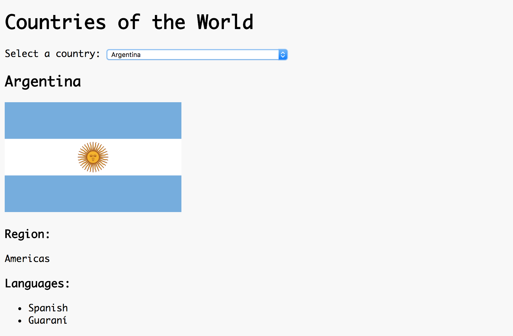

# Requests Lab: Countries of the World

**Lab Duration: 180 minutes**

### Learning Objectives

- Be able to make an `XMLHttpRequest` to receive data
- Be able to navigate JSON data structures
- Be able to integrate an API request into the pub/sub pattern

## Brief

Your task is to create an app that allows users to select a country from a drop-down to see information about it.

*Screenshot of resulting application*

Use the start point provided and use the [Rest Countries API](https://restcountries.eu/) as your data source.

### MVP

- Create a select populated with the name of the countries.
- When a user selects a country from the drop-down, display the country's:
  - name
  - region
  - flag

### Extensions

- In addition to displaying the country's name, region and flag, display a list of the country's languages.

### Considerations

What are the responsibilities of the models and views? What is going to be responsible for making the `XMLHttpRequest`?

Only make one request to load all the data into the application and then manipulate it with JavaScript to update the page. Network requests are slow and this will ensure that users will not have to wait for further requests to complete when the page is updated. It is also considerate to make as few requests to an API as possible, to reduce the load on their server.

### Planning

- Start by making a request Check the shape of the data by making a request to the API from the browser and looking at the JSON.

- Draw a diagram of your files, detailing:

  - the publishing of and subscribing to events.
  - the flow of data through the application.

- When thinking about how to approach the task, one way is to trace the event and data flow, handling the chain of events in sequence.

  1. As the application first needs to the countries data from the API to render the initial state of the page, you could start by making the request to the API from the model.
  2. Once you have checked you can load the data into your application, store the data as a property on the model (so you can access it later) and publish it out the application.
  3. Implement the view that needs the data: `SelectView` subscribes to the data being published and uses it to populate the select. This is now
  4. Once your select is populated with the country names, the next event that needs handling is the `change` event on the select, which is triggered by user interaction. Add an event listener to the select's `change` event, that publishes the index of the selected country out to the application.
  5. The model then subscribes to the channel to receive the published index, finds the corresponding country object, and publishes it out the application.
  6. A second view receives the selected country object and displays it's details to the page.
