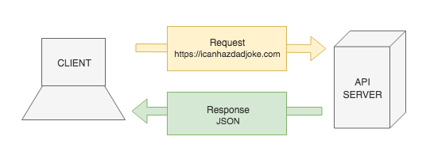

# Requests

**Lesson Duration**: 90 minutes

### Learning Objectives

- Understand what a JSON API is and why we use them
- Understand the order of execution when working with asynchronous code
- Be able to make a request using `XMLHttpRequest`
- Understand the meaning of HTTP status codes
- Understand the relationship between JSON and JavaScript objects
- Be able to traverse a JSON object

## Intro

In this lesson we are going to learn how to request data from an API, so that we can use it in our applications. This can save us a great deal of time, preventing us from having to create the data ourselves.

### What is an API

An API, or application programming interface, is a tool that allows one piece of software to interact with another. A lot of software provides an API, allowing developers to write software that interacts with it. The DOM, for example, is an API. The DOM allows us to write software that interacts with the web browser.

As well as providing us with functionality, some APIs simply provide us with data. We can use this data to enhance the functionality of our applications. Modern APIs tend to provide us with data in JSON format. Some older APIs may still use XML, but that's becoming less popular as JSON continues to gain traction. We'll come back to JSON shortly.

### Why Would We Use an API?

APIs often provide us with functionality or data that would be incredibly difficult and time consuming to create on our own.

Let's imagine that you were building a travel app and needed data about all of the countries in the world. You *could* spend time collecting and organising the data yourself, but it would be very time consuming. It would be much more convenient to use an API like [RESTCountries](http://restcountries.eu/) that can provide us with data that someone else has already prepared.

RESTCountries provides us with data about all of the countries in the world in JSON format.

We can see a list of endpoints on their website. An endpoint is essentially a URL that we can make a request to, allowing us to access the API. Let's take a look at the [all](https://restcountries.eu/rest/v2/all) endpoint. You might install the [JSON Formatter](https://chrome.google.com/webstore/detail/json-formatter/bcjindcccaagfpapjjmafapmmgkkhgoa) Chrome extension to allow the browser to format the data in a more human readable way.

### What is JSON?

JSON, JavaScript object notation, is a language agnostic data interchange format derived from JavaScript. It allows us to store data in a human readable format that appears familiar to programmers of C family languages.

When we say that JSON is language agnostic, we mean that it doesn't know anything about any other programming languages. We will be converting JSON to JavaScript today, but we could just as easily make a request from a .NET application, written in C#, and convert the resulting JSON data to C#. This means that we can use JSON as a common language allowing software that was written in different languages to speak to each other.

While JSON may look very familiar, there are a couple of key differences that we must bear in mind. All JSON is valid JavaScript, but not all JavaScript is valid JSON.

1. The keys in a JSON object must be quoted
2. Strings must be declared with double quotes `""`
3. A JSON object cannot contain functions

## Before We Get Started

We're going to write an app that makes a request to an API which provides us with a random joke, which we will then display in the browser.

> Instructor Note: Hand out the start point along with the following task

### Task: (5 minutes)

Read over the start code and answer the following questions.

Where should we make the request?

<details>
<summary>Answer</summary>

`Joke.prototype.getData`
</details>

<br>

Which channel should we publish an event on once we have the data?

<details>
<summary>Answer</summary>

`'Joke:joke-loaded'`
</details>

<br>

Before we write any code let's think about what we're about to do.

1. Make a request to the icanhazdadjoke API
2. icanhazdadjoke will respond to our request with JSON
3. Use the data in our application



*API Request and Response Diagram*

## Making a Request

Our `Joke` model already has a `getData` method, which we will use to make a request to `'https://icanhazdadjoke.com/'`.

The browser provides us with an API, `XMLHttpRequest`, which can be used to make requests in our client-side code. The name is somewhat misleading, as it can be used to retrieve any kind of data (not just XML) and supports protocols other than HTTP, but it provides the functionality that we need.

The first thing that we need to do is use the `XMLHttpRequest` constructor to instantiate an object.

```js
// joke.js

Joke.prototype.getData = function () {
  const xhr = new XMLHttpRequest(); // NEW
}
```

Next we have to initialise the `XMLHttpRequest`. We do this by calling a method, `open`, and passing two pieces of information to it as strings.

1. The HTTP method that our request should use
2. The URL that we will be making a request to

In this case, we will be using a `'GET'` request to `'https://icanhazdadjoke.com'`.

```js
Joke.prototype.getData = function () {
  const xhr = new XMLHttpRequest();
  xhr.open('GET', 'https://icanhazdadjoke.com'); // NEW
}
```

Now that our request is initialised, it's ready to go. We can use the `send` method to actually make the request.

```js
Joke.prototype.getData = function () {
  const xhr = new XMLHttpRequest();
  xhr.open('GET', 'https://icanhazdadjoke.com');
  xhr.send(); // NEW
}
```

If we open up the network tab and refresh the page in the browser, we can see that our request to icanhazdadjoke.com is responding with a status code of 200. This means that it's completing successfully. If we click on the request and look at the preview, we can see that we're receiving an HTML file in response to our request. This isn't what we want. We want to receive JSON so that we can use it in our app.

We can use a request header to add some additional information to our request. We need to tell the server what kind of data we would like to receive in response to our request. In this case, we want to receive JSON.

We have to do this after the request has been initialised, but before it is sent.

```js
Joke.prototype.getData = function () {
  const xhr = new XMLHttpRequest();
  xhr.open('GET', 'https://icanhazdadjoke.com');
  xhr.setRequestHeader('Accept', 'application/json'); // NEW
  xhr.send();
}
```

If we refresh the page again, we can see that we're now receiving a JSON object instead of HTML. How can we access this data in our application? Before we can answer this question we have to understand a few things about network requests.

## Accessing the Returned Data

Network requests are asynchronous. This has two major implications.

1. They take an unspecified amount of time to complete
2. Execution of the rest of our code is not paused in the mean time

We handle this by adding an event listener to our `XMLHttpRequest` object. The event that we will be listening for is the load event, which will be dispatched when we receive the response to our request. This response should contain the data that we requested.

```js
Joke.prototype.getData = function () {
  const xhr = new XMLHttpRequest();

  xhr.addEventListener('load', () => { // NEW

  });

  xhr.open('GET', 'https://icanhazdadjoke.com');
  xhr.setRequestHeader('Accept', 'application/json');
  xhr.send();
}
```

Now that we've added an event listener to the request, we can execute some behaviour when it has completed. First we will check the status code of our request, so that we can prevent any errors that might occur if our request hasn't completed successfully. The status code for a successful get request is 200. We'll check if our request completed with any status other than 200. If that is the case then we will `return`, preventing the rest of our callback from executing.

```js
// ...

xhr.addEventListener('load', () => {
  if (xhr.status !== 200) { // NEW
    return;
  }
});

// ...
```

Great, if our callback continues to execute beyond the `if` statement then we'll know that we have the data that we need. We can find the data attached to the `XMLHttpRequest` object, `xhr`. The property that we need to access is `responseText`. Let's `log` it to the console and take a look at it.

```js
// ...

xhr.addEventListener('load', () => {
  if (xhr.status !== 200) {
    return;
  }

  console.log(xhr.responseText); // NEW
});

// ...
```

That's our data, but it has been serialised, or converted into a string.

All data (including JSON) that is sent over HTTP must be serialised. This is why the browser has trouble displaying JSON in a readable way and we had to install an extension to do so. We have deserialise our data before we can use it in our applications. As this is something that's very commonplace in JavaScript, there's a method that we can use to do this for us; `JSON.parse()`.

First we'll store the serialised version of our data in a variable, then we'll `parse` it. Once we've done this we'll have a useable JavaScript object. Let's `console.log` this object so we can determine what properties we might want to make use of.

```js
// ...

xhr.addEventListener('load', () => {
  if (xhr.status !== 200) {
    return;
  }

  const jsonString = xhr.responseText; // NEW
  const data = JSON.parse(jsonString); // NEW
  console.log(data); // NEW
});

// ...
```

> Instructor note: Ask the students how we get the text of our joke from the returned data


The text of our joke is on the `joke` property of the `data` object.


```js
// Chrome Console
{
  "id": "4EBsPZvP7h",
  "joke": "Some people eat light bulbs. They say it's a nice light snack.",
  "status": 200
}
```

We can store the joke text on the `text` property of our `Joke` object and publish an event on the `'Joke:joke-loaded'` channel to transmit the data to our view.

```js
// ...

xhr.addEventListener('load', () => {
  if (xhr.status !== 200) {
    return;
  }

  const jsonString = xhr.responseText;
  const data = JSON.parse(jsonString);

  this.text = data.joke; // NEW
  PubSub.publish('Joke:joke-loaded', this.text); // NEW
});

// ...
```

## Refactoring

We're getting data from an API and displaying it in our app. This is great, but our code could be cleaned up a little. What if we wanted to make a separate request to another API in a different model? We would have to repeat everything that we have just written in that model too. It may be better if we extracted the network request code into a helper model.

We'll create a `Request` helper in our helpers directory with `PubSub`.

```sh
touch src/helpers/request.js
```

Let's create the constructor and a `get` method for our `Request` helper.

```js
// request.js

const Request = function () { // NEW

}

Request.prototype.get = function () { // NEW

}
```

We'll pass the URL that we want to make a request to into the constructor when we instantiate a `Request` object. Let's add a `url` property and initialise it via a parameter.

```js
const Request = function (url) { // MODIFIED
  this.url = url; // NEW
}

// ...
```

Next, we'll copy and past the body of our `getData` method into `get`. We'll have to change a couple of things, but the bulk will remain the same.

```js
// ...

Request.prototype.get = function () {
  const xhr = new XMLHttpRequest(); // NEW

  xhr.addEventListener('load', () => {
    if (xhr.status !== 200) {
      return;
    }

    const jsonString = xhr.responseText;
    const data = JSON.parse(jsonString);
    this.text = data.joke;
    PubSub.publish('Joke:joke-loaded', this.text);
  });

  xhr.open('GET', 'https://icanhazdadjoke.com');
  xhr.setRequestHeader('Accept', 'application/json');
  xhr.send();
}
```

The first change that we will have to make is adding a parameter. The `get` function will receive a callback function as an argument, allowing us to decide what to do once the request has completed, as this will be different depending on where the method has been called.

```js
Request.prototype.get = function (onComplete) { // MODIFED
  // ...
}
```

Next, we'll remove the code specific to the `Joke` model. This will be replaced by the callback function, which we will pass the data to.

```js
// ...

xhr.addEventListener('load', () => {
  if (xhr.status !== 200) {
    return;
  }

  const jsonString = xhr.responseText;
  const data = JSON.parse(jsonString);
  this.text = data.joke; // REMOVED
  PubSub.publish('Joke:joke-loaded', this.text); // REMOVED
});

// ...
```

```js
// ...

xhr.addEventListener('load', () => {
  if (xhr.status !== 200) {
    return;
  }

  const jsonString = xhr.responseText;
  const data = JSON.parse(jsonString);
  onComplete(data); // NEW
});

// ...
```

Lastly, we can remove the hard-coded string that we're using for the URL. This can be replaced with a reference to the `url` property of the `Request` object. Now we could instantiate multiple `Request` objects, each making requests to different places.

```js
// ...

xhr.open('GET', this.url); // MODIFIED
xhr.setRequestHeader('Accept', 'application/json');
xhr.send();
```

Our `Request` helper is now ready to use. Now all that we have to do is to refactor our `Joke` model to use it. First, we'll need to `require` the `Request` helper in our `Joke` model.

```js
// joke.js

const Request = require('../helpers/request.js'); // NEW
const PubSub = require('../helpers/pub_sub.js');

// ...
```

Then we can delete all of the request code in `getData` and instantiate a `Request` object, passing it the URL that we want to make a request to.

```js
Joke.prototype.getData = function () {
  const request = new Request('https://icanhazdadjoke.com'); // NEW
}
```

Now that we have a `Request` object, we can use its `get` method to make our get request.

```js
Joke.prototype.getData = function () {
  const request = new Request('https://icanhazdadjoke.com');
  request.get(); // NEW
}
```

`get` is expecting a callback function to be passed as an argument. This callback will be invoked when the request has completed, passing the data back to us. Let's add the callback.

```js
Joke.prototype.getData = function () {
  const request = new Request('https://icanhazdadjoke.com');
  request.get((data) => { // MODIFIED

  });
}
```

Once we've got the data, we can set the `text` property of the `Joke` object and emit an event on the `'Joke:joke-loaded'` channel.

```js
Joke.prototype.getData = function () {
  const request = new Request('https://icanhazdadjoke.com');
  request.get((data) => {
    this.text = data.joke; // NEW
    PubSub.publish('Joke:joke-loaded', this.text); // NEW
  });
}
```

## Recap

Name three ways that JSON differs from JavaScript

<details>

<summary>Answer</summary>

1. The keys in a JSON object must be quoted
2. In a JSON object strings must be declared with double quotes `""`
3. A JSON object cannot contain functions

</details>

Where do we get access to the XMLHttpRequest object from?

<details>

<summary>Answer</summary>

The browser

</details>

What are the consequences of requests being asynchronous and how do we handle their asynchronicity?

<details>

<summary>Answer</summary>

As requests are asynchronous we don't know how long they will take, and therefore we don't know how long it will be before we have the response data. To handle the asynchronicity of the request, we can add behaviour to the request's 'load' event by using a callback, which will be called once the request has completed. We can be sure that when the callback is invoked, the request will have completed and therefore we will have access to the response data.

</details>

## Conclusion

We have seen how we can use the browser's `XMLHttpRequest` object to make a request to an API to quickly and easily load JSON data into our application. Requests enable us to leverage the work of other developers who have made their API public.

Requests are asynchronous and therefore we cannot guarantee when we will have access to the data sent with the response. To handle this asynchronicity we have used callbacks, which are called when the request is completed.

By creating a request helper that is responsible for the request functionality, we ensure our application remains modular. If we then wanted to make further requests from elsewhere in the application, having the request helper will ensure our code is DRY.
