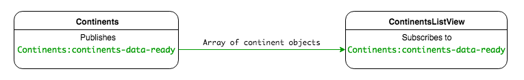
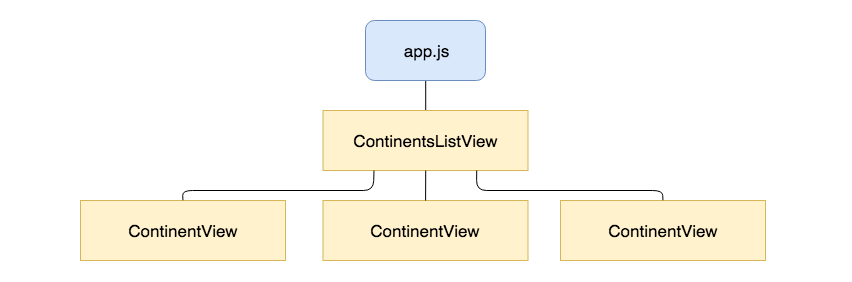
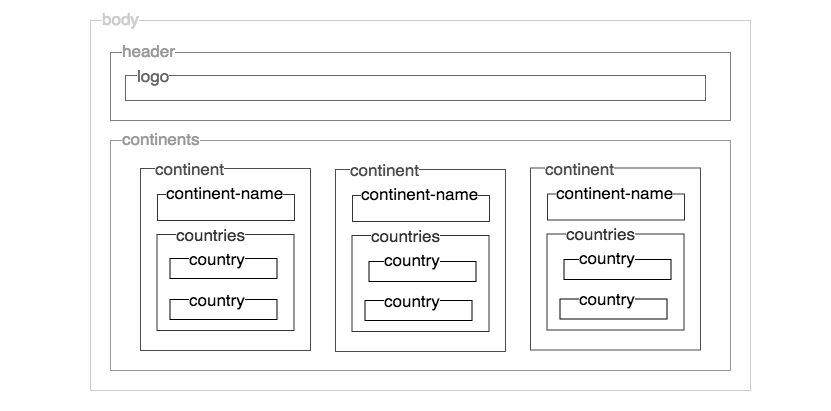

# Pub/Sub with Nested Reusable Views Homework

## Solutions

### Application Architecture

*Pub/Sub event and data flow through the app*

### Application Views

*Hierarchy of responsibilities for view rendering*

*Structure of the web page*

Which view is rendered more than once on the page?

Answer:

`ContinentView` - One `ContinentView` is rendered for each continent.

Which views are nested in which other view?

Answer

- The `ContinentView`s are nested in `ContinentsListView`.

What is the benefit of nesting views in this way?

Answer

By nesting views we can maintain modularity in our front-end code, where each view is responsible for rendering one section of the page. The tree-like structure that it produces is easy to reason about.

What is the benefits of reusing views in this way?

Answer

By creating generic views that can be populated for each item keeps the code DRY and maintainable.

## Conclusion

As our applications grow in size we can use nested reusable views with the Pub/Sub pattern to keep our applications modular, each view having the responsibility of rendering one section of the page. This makes our applications ease to reason about and our code DRY.
