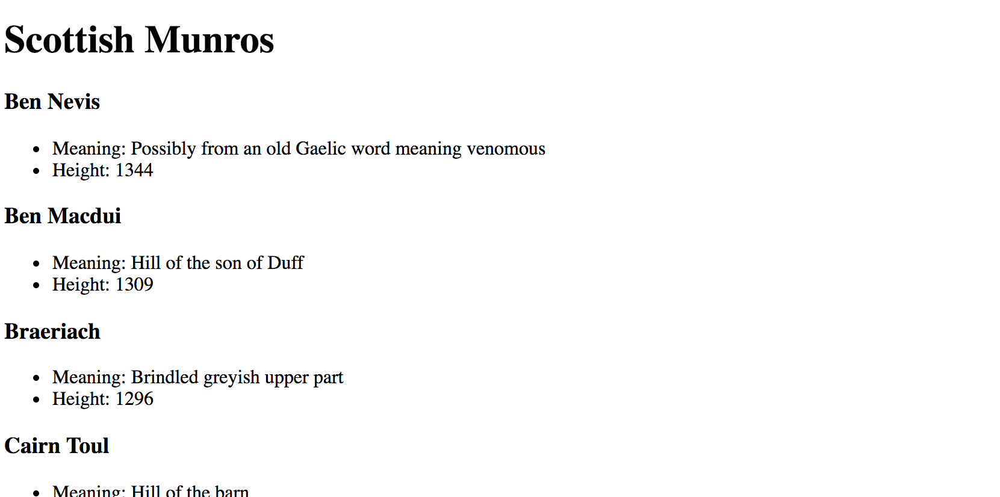
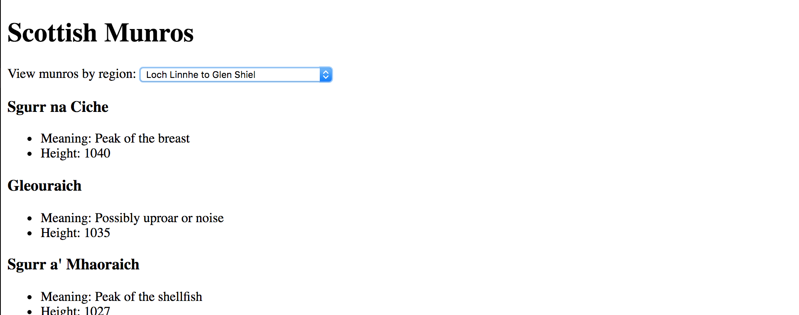

# Scottish Munros App

**Lab Duration: 180 minutes**

### Learning Objectives

- Be able to create a web app with a modular front-end
- Be able to implement reusable and nested views

## Brief

Your task is to create an app that displays a list of all the Scottish Munros. (A Munro is a mountain over 3,000 feet). Use the [Munros API](https://munroapi.herokuapp.com/) to make a request to get the data.

### MVP

- Display a list of the mountains.
- Views should be reused where ever possible.
- Any views that are created dynamically should be nested within a wrapper view to avoid app.js having too many responsibilities.

*Screenshot of example result after completing MVP*

### Extensions

Allows a user to filter Scottish Munros by region. When a user selects a region from the drop-down, the mountains for that region, with a selection of their information, should be displayed.

- Add a select that contains a list of regions and allows a user to filters displayed list of mountains by region.

*Screenshot of example result with extensions complete*

## Considerations

What are the responsibilities of the views and models? What is responsible for listening to the change of the select? What is responsible for rendering the filtered mountains?

Where is there repeated information being displayed where a reusable view could be implemented to help make the front-end code dry? What will be responsible for populating that reusable view for the collection of data?

## Planning

Draw a diagram of your files, detailing:

- the publishing of and subscribing to events.
- the flow of data through the application.
- views that render other views.

A possible approach you could take:

- Make the request for the Munros data in a model
- Publish the Munros data to the rest of the application
- In a list view, subscribe to the channel on which the Munros data has been published
- When you have the Munros data in your list view, iterate over the collection of data and for each munro object, create a detail view that is responsible for rendering one mountain's informtation

In this case, the detail view is the reused view as it is reused for each munro in the data collection. As the list view is responsible for rendering the detail views, the detail views are nested inside the list view.
