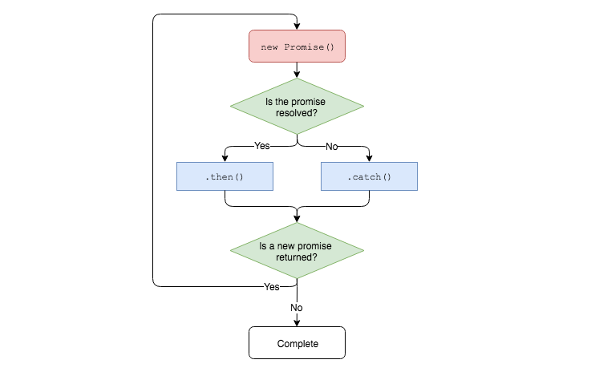

# Promises

**Lesson Duration: 60 minutes**

### Learning Objectives

- Understand the benefits of Promises
- Be able to return a Promise from a function
- Be able to use `.then` chains to handle asynchronicity
- Be able to use `.catch` for error handling
- Be able to use `fetch` to request data

## Intro

Previously, we learned about the `XMLHttpRequest` web API and how we can use it to make network requests without refreshing the page or navigating to another page in the browser. We know that requests made using `XMLHttpRequest` are asynchronous, which means that when we make a request we don't know when we will receive a response. We have been using callbacks to handle this asynchronicity. When we create an `XMLHttpRequest` we attach a function, detailing what we would like to do once the request is complete, to it. It will then invoke this function at some point in the future, when it is complete.

In this lesson we're going to learn about Promises, which are fantastic for dealing with asynchronous operations within our code. Promises vastly reduce the need to pass callbacks around and make our asynchronous code read more simlilarly to linear, synchronous, code. Promises are one of the newer features of JavaScript but more and more libraries are starting to use Promises to handle asyncronous actions (like making requests or connecting to a database). As a result they're quickly becoming an integral part of the language.

We're going to use `fetch` (a web API like `XMLHttpRequest`) to make requests. `fetch` uses `Promise` objects and sensible default settings to greatly simplify this process.

## Activity Suggestion App

We are going to create an application that recommends activities to the user when they are bored. The user can enter the type of activity that they would like (educational, recreation, relaxation, etc.) and we will get a suitable activity from the [Bored API](https://www.boredapi.com/) for them.

> PubSub diagram of data flow

> Open the start code

You'll notice that the way that we handle our request in this app is slightly different to the way that we have done things previously. We're passing two callbacks to `request.get`. `onComplete` will be invoked if our request is successful and `onError` will be invoked in the event of our request failing. As well as determining what we want to do when the request completes, this allows us to handle any failed requests; displaying a meaningful message to the user instead of an empty page.

## `fetch`

In this lesson we're going to rework our request code to use `fetch` instead of `XMLHttpRequest`. To do this we'll need to make modifications to our code in two different places:

1. `Request.prototype.get`
2. `Activity.prototype.getData`

We'll start by making the changes to `Request.prototype.get`. First, we need to remove the existing parameters and function body. `fetch` returns a `Promise` object, which can be handled at the callsite when the `get` method is invoked, so we won't need the callbacks any more.

```js
Request.prototype.get = function () { // MODIFIED

};
```

Now that we're ready to get started with `fetch`, we can invoke it, passing to it the URL that we want to make a request to as a string. We also need to `return` the `Promise` object that we get back from `fetch`.

```js
Request.prototype.get = function () {
  return fetch(this.url); // NEW
};
```

Thanks to the sensible default settings of `fetch` this is all we have to do to configure and send our request. It will make a GET request with no data attached to it by default. We can check the MDN documentation for [Using Fetch](https://developer.mozilla.org/en-US/docs/Web/API/Fetch_API/Using_Fetch) for details on how to configure this request should we need to do something more complex.

If we open the network tab in our browser's dev tools and refresh the page, we should now see the request being sent.

Now that we've made our request, we need to learn how to access the data that is sent back to us with the response. `fetch` wraps the response object that we get back in a `Promise` object.

### What is a `Promise`?

Just like a real life promise that represents something that will happen in the future, a JavaScript `Promise` object represents the result of an asynchronous operation. In our case the `Promise` object will represent the data that we hope to get back from the Bored API. You can think of a `Promise` as a wrapper for a value that doesn't exist yet. With regards to asynchronous JavaScript, this allows us to use the `return` keyword inside of functions without worrying that the data might not have been received yet.

We can `return` a `Promise` from our function and then decide what to do once the asynchronous operation has completed and we're able to access the value within the `Promise`. As a result we don't have to pass callbacks to our asynchronous functions, meaning that our code reads a bit more as if it were synchronous, which can be easier to follow.

### How Does a `Promise` Work?

When a `Promise` object is created it will be pending until the asynchronous operation that it is wrapping has completed. Then, just like a real life promise that can be kept or broken, the `Promise` object will either `resolve` (if successful) or `reject` (if it fails). We can then decide what we want to do next.

We can create a method chain on any method that returns a `Promise` as follows:

```js
Request.prototype.get = function () {
  return fetch(this.url)
    .then(() => {}) // NEW
    .catch(() => {}); // NEW
};
```
 > Note: There is no semicolon after `.then(() => {})`. Adding a semicolon would break our method chain.

If the `Promise` _resolves_, or completes successfully, the callback that we passed to `then` will be invoked. If the `Promise` _rejects_, or fails, the callback that we passed to `catch` will be invoked, much like the `onComplete` and `onFail` callbacks, which we saw earlier.

We may want to handle the failure of different requests differently, so we'll leave it up to the caller to determine what to do if the request fails. We don't need a `catch` here.

```js
Request.prototype.get = function () {
  return fetch(this.url)
    .then(() => {}); // MODIFIED
    // .catch(() => {}); // DELETED
};
```

Like `fetch`, `then` also returns a `Promise` object wrapping whatever value was returned from the callback that was passed to it. This enables us to chain `then`s. This can be useful if you need to make requests to multiple APIs, or otherwise perform a series of asynchronous actions.



_A Promise Chain_

## Using `fetch`

We know that fetch returns a `Promise` object to us. This `Promise` is wrapping an object representing the response that we will get back from the API once our request has completed. This response object is not the value that we want to return from the `get` method. We want to return the data that was sent to us with the response.

This means that we can chain a `then` after `fetch` and pass to it the bahaviour that we want to execute if our request is successful. The value that the `Promise` is wrapping will then be passed as an argument to our callback.

```js
Request.prototype.get = function () {
  return fetch(this.url)
    .then((response) => { // MODIFIED
      console.log(response);
    });
};
```

## Extracting Data From `response`

The data that we got back from the API has been serialised so that it could be sent over HTTP. We need to deserialise it before we can use it, just like we did when we were using `XMLHttpRequest`. `response` has a `json()` method, which we can use to do this. `response.json()` also returns a `Promise` object, this is the value that will be returned from `Request.prototype.get`.

```js
Request.prototype.get = function () {
  return fetch(this.url)
    .then((response) => {
      return response.json(); // NEW
    });
};
```

As the body of our arrow function is a single expression, we can drop the braces and utilize its implicit return.

```js
Request.prototype.get = function () {
  return fetch(this.url)
    .then((response) => response.json()); // MODIFIED
};
```

That's all we need to do in the `get` method. As we've changed the way that it works we'll need to change the way that we're using it in `Activity.prototype.getData`. We aren't using either of the callbacks that we're passing in to `request.get()` any more, so the first thing that we should do is remove them.

```js
// activity.js

Activity.prototype.getData = function (activityType) {
const url = `https://www.boredapi.com/api/activity?type=${ activityType }`;
  const request = new Request(url);
  request.get(); // MODIFIED
};
```

We know that `request.get` returns a `Promise` object. This allows us to use `.then()` to decide what we would like to do once the request has completed and our data is ready. The callback that we pass to then will receive the value that the promise given to us is wrapping. In this case, this will be the data that we received from the BoredAPI.

```js
// ...

request.get()
  .then((activity) => { // NEW

  });
```

Now that we have the data, the first thing that we want to do is cache it. That is, store a reference to it in our data model.

```js
// ...

request.get()
  .then((activity) => {
    this.data = activity; // NEW
  });
```

Next we will publish our data on the `'Activity:activity-ready'` channel so that it can be rendered by a view.

```js
// ...

request.get()
  .then((activity) => {
    this.data = activity;
    PubSub.publish('Activity:activity-ready', this.data); // NEW
  });
```

Excellent. Our app works. That is, of course, unless it doesn't work. What if our request is unsuccessful? We can use `catch` to do some error handling in the event that our `Promise` rejects. If the `Promise` rejects then we want to publish an event on a different channel, so that a meaningful message of some kind can be displayed to the user.

```js
// ...

request.get()
  .then((activity) => {
    this.data = activity;
    PubSub.publish('Activity:activity-ready', this.data);
  }) // MODIFIED
  .catch(); // NEW
```

> Note: Make sure you remove the `;` after `then()`. We need to chain these methods

Just like `then`, we need to pass a callback to `catch`. Our callback will receive an error object describing what went wrong.

```js
// ...

request.get()
  .then((activity) => {
    this.data = activity;
    PubSub.publish('Activity:activity-ready', this.data);
  })
  .catch((err) => { // MODIFIED

  });
```

In our callback we will publish an event on the `'Activity:error'` channel, sending the error object with it, so that it can be handled elsewhere.

```js
// ...

request.get()
  .then((activity) => {
    this.data = activity;
    PubSub.publish('Activity:activity-ready', this.data);
  })
  .catch((err) => {
    PubSub.publish('Activity:error', err); // NEW
  });
```

Disable your wifi connection and refresh the page. You should now see that a message is displayed to the user and our error is displayed in the console if something goes wrong.

## Recap

What are some of the advantages of using promises when writing asynchronous JavaScript?

<details>
<summary>Answer</summary>
Promises allow us to write asynchronous code that reads as a structured series of events, rather than a series of callbacks, which can be more difficult to follow.
</details>

<br>

Which method do we call after receiving a `Promise` to determine which behaviour we want to execute it resolves successfully?

<details>
<summary>Answer</summary>

`then`

</details>

<br>

Which method do we call after receiving a `Promise` to determine which error handling behaviour we want to execute it rejects?

<details>
<summary>Answer</summary>

`catch`

</details>

<br>

How do we write a function that can be chained using `then` and `catch`?

<details>
<summary>Answer</summary>
We must return a `Promise` object from a function.
</details>

## Conclusion

Now that we've learned how to use `Promise` objects and the `fetch` web API, we can write asynchronous JavaScript that almost reads as if it were synchronous. Our code appears more like a structured series of events, even if we aren't sure exactly _when_ things will happen. In short, promises allow us to write neater asynchronous code.

`fetch` also abstracts away some of the lower level implementation details of our HTTP request. We don't really have to care exactly how `fetch` is implemented, we just care that we get our data back.

This isn't all that there is to learn about promises, however. Promises really come into their own when it comes to carrying out multiple asynchronous operations either sequentially, using a `then` chain, or at the same time, using `Promise.all`.

## Further Resources

MDN - [Promises](https://developer.mozilla.org/en-US/docs/Web/JavaScript/Reference/Global_Objects/Promise)  
MDN - [`Promise.all`](https://developer.mozilla.org/en-US/docs/Web/JavaScript/Reference/Global_Objects/Promise/all)
