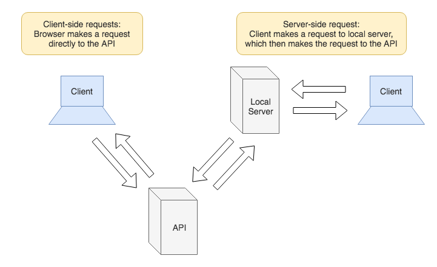

# Server-side Requests

**Lesson Duration: 45 minutes**

### Learning Objectives
- Be able to make a server-side request
- Be able to serve JSON data from an Express server in response to a request

## Introduction

So far we have been making requests to APIs from our applications, to get back data in the form of JSON, using the window's `XMLHttpRequest` object. This has involved making a request to a server with a different location (domain) to that of our application. Making requests from the browser in this way is a quick and simple way of loading data into our applications, but due to the security risks involved, browsers do not allow us to do it by default. We are only able to make an API request from the browser if the API we are making our request to, has implemented CORS (Cross-Origin Resource Sharing) and not all APIs do.

To use APIs that don't implement CORS, we can make a request from our server, instead of making the request from the browser.

We know how to create a server in JavaScript using Express. We can use our server to handle a request from our application that:

- makes a request to an API for data
- sends the data back to the client in the response

This enables us to load the data from the API into our applications without making a request from the browser.



*Request/Response Cycle for Client-side and Server-side requests*

## XMLHttpRequest Request Made from the Browser

> Hand out the start code

Run the app:

```bash
npm install
npm run build
npm run server:dev
```
Have a look at the start code:

- Find where the Chasing Coins API request is being made
- Make the Chasing Coins API request from your browser's address bar to see what data we are expecting to get back
- Look at the view to see what it is rendering to the page

The app has an Express server that is responding to requests made to the home route with the index.html. When visiting the home route we expect to see the title, 'BitCoin' followed by the text '`Currently £`' and the current price of BitCoins retrieved from the API. But instead we see a CORS error in the console, followed by an error telling us that the `fetch` used to make the API request failed.


*Cors error in browser console*

## CORS

By default web browsers do not allow an application to make a request to a server with a different location (domain). This is a web security policy called same-origin policy. CORS is a way of bypassing this policy. Developers of an API can implement CORS to allow other locations to make requests to their API endpoints. This is useful if you are building an application with the front-end running on one server, and the back-end running on another, because you can specify the front-end as a trusted location and allow it to make requests from the back-end service. However, making the API available to any user can lead to security risks.

### Security Risks Involved with CORS

Requests coming from the browser enable the developer of a website to make requests from a users machine, so the developer is authenticated as if they were the user.

- A user logs into their online banking, and the browser creates a cookie with their user details
- The user visits a malicious website
- The malicious website makes a client-side `XMLHttpRequest` from their browser to their bank
- This request is coming from their machine, they are authenticated, so the malicious website is able to access their data

The error we are getting in the console is due to the Chasing Coins API not allowing browser requests from our location. So how do we load the data from the API into our application, so that we can display it? Instead of making an XMLHttpRequest from the browser, we can do it from the server.

## Server-side Requests

Our front end application will make a request to our own server on a defined route ('/coin-data'). The server will then make a request to the API to get the data, and send it back to the application as the response.


*Request/Response Cycle our application's Server-side request*

### Making a Request from a Server

As we don't have the window's `XMLHttpRequest` object available in node, we will use a package that handles requests and implements `fetch` called `node-fetch`. Let's start by installing it.

```bash
npm i node-fetch
```

Next we will import `node-fetch` in the server.

```js
// server.js

const express = require('express');
const app = express();
const fetch = require('node-fetch'); // NEW
```

We will use the `get` method to define a new route, passing it a route path as a string, and a callback that will be passed the request and response objects.

```js
app.get('/', (req, res) => {
  res.sendFile('index.html');
});

app.get('/coin-data', (req, res) => { // NEW

});
```

We need to define the url for the API request to the Chasing Coins API.

```js
app.get('/coin-data', (req, res) => {
  const url = 'https://chasing-coins.com/api/v1/std/coin/BTC'; // NEW

});
```

Lastly we will use node-request to make the request to the Chasing Coins API, get back the JSON string, parse it and log it.

```js
app.get('/coin-data', (req, res) => {
  const url = 'https://chasing-coins.com/api/v1/std/coin/BTC';

  fetch(url)  // NEW
    .then(jsonData => jsonData.json())
    .then(data => console.log(data));
});

```

Nothing will be displayed in the browser yet as we haven't sent the data to the client, but the log in the server should output the data in the terminal window where the server is listening on port 3000. To check this, make sure the server is running, visit http://localhost:3000/coin-data in the browser and look in the terminal window to see the data logged out.

### Send Data from Server to Client

We have got the data loaded into the server, next we want to send it back to the client. We will use the response object (`res`) that gets passed to our callback by the `get` method. Previously we have used the response object's `sendFile` method to send the index.html with the response. This time we want to send back JSON, so we will use the response object's `json` method, passing it the JSON data we want to send back to the client.

```js
app.get('/coin-data', (req, res) => {
  const url = 'https://chasing-coins.com/api/v1/std/coin/BTC';

  fetch(url)
    .then(jsonData => jsonData.json())
    .then(data => res.json(data)); // MODIFIED
});
```

Now we can refactor the front-end code, to make its request for the coin data from our server.

### Task: (5 minutes)

Refactor the application to make the request to the route we have just written, `/coin-data`, so that the BitCoin's current price is displayed on the page when you visit http://localhost:3000.

<details>
<summary>Example solution</summary>

```js
document.addEventListener('DOMContentLoaded', () => {
  // ...

  const bitCoinUrl = 'http://localhost:3000/coin-data'; // MODIFIED
  const coin = new Coin(bitCoinUrl);
  coin.getData();
});
```

</details>

<br>

We have now resolved the issue of the API not allowing us to make browser requests by making the request from our server.


## Recap

What problem does making a server-side request solve?
<details>
<summary>Answer</summary>

By making server-side requests we don't have to rely on an API implementing CORS to make it's endpoints available to all locations.

</details>

What Express method did we use in the server to send back JSON in response to a request? What object is it called on and what does it take as an argument?
<details>
<summary>Answer</summary>

`json` is called on the response object and we pass it the data we want to send to the client.

</details>

## Conclusion

Server-side requests mean we won't have the be reliant on an API service implementing CORS to make its end-points available to us. In our server we have handled a request that is responsible for making the request to the API and sending it back to our application in the response.

## Further Resources

[CORS on MDN](https://developer.mozilla.org/en-US/docs/Web/HTTP/CORS)
