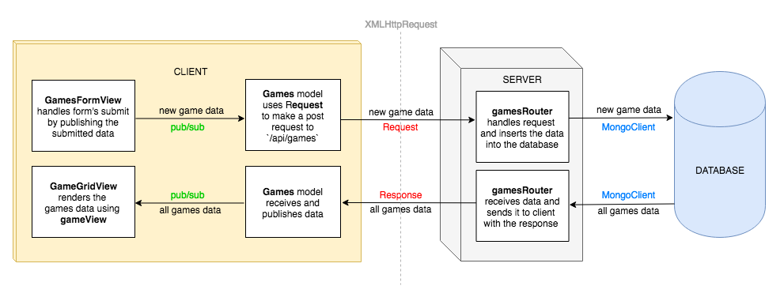

# Homework: Full Stack Games Hub App

## MVP

### Task

Draw a diagram showing the dataflow through the application starting with a form submission, ending with the re-rendering of the page. This will involve a multi-direction data-flow with the client posting data to the server and the server sending data back to the client with the response. Detail the client, server and database in the diagram and include the names of the files involved in the process.



*Diagram of the dataflow through the application when a user submits the form*

### Questions

What is responsible for defining the routes of the `games` resource?

<details>
<summary>Answer</summary>

`gamesRouter`

</details>

What are the the responsibilities of server.js?

<details>
<summary>Answer</summary>

server.js is responsible for:

- using bodyparser, which enables the server to access the body from requests
- serving static files (the client's `public` directory) to the browser
- connecting to the `games_hub` database using the MongoDB driver
- accessing the `games` collection from the database and pass it to `createRouter`
- delegating the routing for the `games` resource to `gamesRouter` on the path `/api/games`
- listening for requests being made on on a specific port

</details>

What are the responsibilities of the `gamesRouter`?

<details>
<summary>Answer</summary>

`gamesRouter` is responsible for defining the routes for the `games` resource and interacting with the database for each route as appropriate.

</details>

What process does the the client (front-end) use to communicate with the server?

<details>
<summary>Answer</summary>

The client sends `XMLHttpRequest`s to the server via the set of routes defined in the router (e.g. 'localhost:3000/api/games').

The front-end application uses `fetch` to make the `XMLHttpRequest`s.

</details>

What optional second argument does the `fetch` method take? And what is it used for in this application?

<details>
<summary>Answer</summary>

When `fetch` is passed only a URL as an argument, it makes a GET request by default. However `fetch` takes an optional second argument of an `init` object that can be used to specify the request settings.

In this application the `request` helper's methods `post` and `delete` both pass `fetch` an object specifying the type of request. Additionally, in the case of the `post` method, it is also used to send the body of the request and specify the body type as JSON using a header.

```js
Request.prototype.post = function (payload) {
  return fetch(this.url, {
    method: 'POST',
    body: JSON.stringify(payload),
    headers: { 'Content-Type': 'application/json' }
  })
    .then((response) => response.json());
};
```

</details>

Which of the games API routes does the front-end application consume (i.e make requests to)?

<details>
<summary>Answer</summary>

- index (GET)
- create (POST)
- destroy (DELETE)

</details>


## Extensions

- What are we using the [MongoDB Driver](http://mongodb.github.io/node-mongodb-native/) for?

<details>
<summary>Answer</summary>

The MongoDB Driver is a library that enables us interact with the MongoDB database from inside our JavaScript application.

</details>

- Why do we need to use [`ObjectId`](https://mongodb.github.io/node-mongodb-native/api-bson-generated/objectid.html) from the MongoDB driver?

<details>
<summary>Answer</summary>

When the front-end makes a request regarding a specific game (SHOW, UPDATE, DELETE), the server access the ID of the particular game from the params object. This is always a string. To query the database for an object of a particular ID, if we ask it for the object with the ID of string type, it will never find a match. It needs us to make the query with an instance of `ObjectId`. We create the instance of `ObjectId` by passing in the ID as a string, for example, `ObjectId("5af17fe430e043c3e62149b8")`.

</details>
