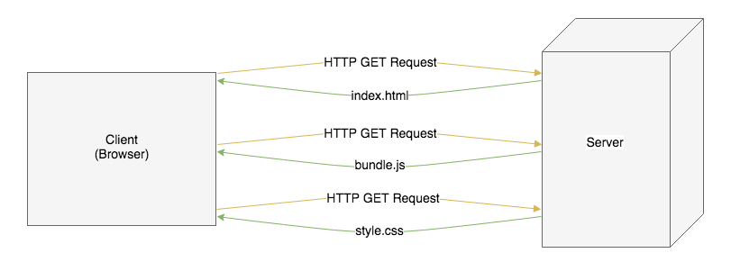
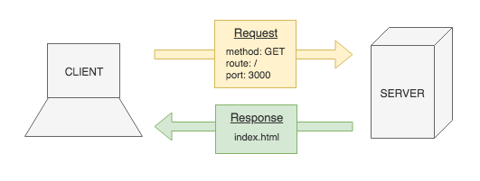

# Intro to Express

**Lesson Duration: 60 minutes**

## Learning Objectives
- Know what Express is
- Be able to use Express to serve static files

## Intro

We've learned a lot about JavaScript already, but so far we've concentrated solely on front-end. Now it's time to start looking at the the other end of the stack. We're going to learn how to write a simple web server using a JavaScript library called Express. In this lesson we will write a basic web server which responds to requests with static files, such as .html or image files.

The ability to write a web server opens up a lot of possibilities. We could deploy our apps to a server in the real world, create our own API or add greater back-end functionality; a database layer, for example.

## What is Express?

Express is an unopinionated, lightweight web framework for Node.js apps. We can use Express to write a web server that will listen for requests and serve our files to clients.

What do we mean when we say that a framework is unopinionated? This means that the framework is flexible and doesn't force us to adhere to their way of doing things.

## Song Lyrics Application

Take a few minutes to read over the start code. It contains an application that allows a user to submit the name of an artist and a song and see the lyrics displayed on the page.

You should notice that the structure of the project is somewhat familiar. The code inside of the client folder is structured much the same way as the Webpack projects that we have created previously. The only major difference is that what would have been our entire project is now nested in a folder called 'client'. This is our client-side, or front-end, code. These are the files that will be sent to the client. We'll keep our server-side code (anything related to the server or database) outside of the client folder.

By the end of the lesson we will have created a server that responds to a GET request by sending the index.html file that is in the client/public directory. This will allow us to run the application by visiting 'http://localhost:3000/' in the browser (rather than opening the index.html in the browser as we have been doing previously). The index.html contains links to the JavaScript bundle and CSS, so once the browser has received the index.html it will make further requests to get those resources.



*Request/response cycle of HTML, JavaScript and CSS Resources*

## Creating a Web Server using Express

We are going to write a simple server that handles the following HTTP request:

- method: GET
- route: home route ('/')
- port: 3000

We are going to respond to that request, firstly, by sending back a simple string to the client. Once we have done that, we will see how to send back static files, such as HTML.



*Request/response cycle of the server we are going to build*

### Installing Express

If we want to create a web server with Express then the first thing that we need to do is install Express.

```sh
npm install express
```

### Creating the Server

Now that we've installed Express, getting a simple web server up and running and handling our request only requires us to write a few lines of code. First, we'll create a file called server.js, which will contain our server code.

```sh
touch server.js
```

Now that we have a file to work in, we can `require` Express, so that its functionality is available to us.

```js
const express = require('express'); // NEW
```

When we `require` Express, we are given a function. This function returns an object that provides us with various methods that we'll need to create a server. Let's invoke `express` and store the returned object in a variable called `app`.

```js
const express = require('express');
const app = express(); // NEW
```

### Defining Routes

Now we can use Express to define our routes. It has a set of methods that correspond the the HTTP request methods, including:

1. GET - `get`
2. POST - `post`
3. PUT - `put`
4. DELETE - `delete`

Each of these methods takes two arguments:

1. The route as a string.
2. A callback containing the behaviour that we would like to execute when we receive a request to this route.

We want to enable a client making a GET request to the home route, to see `'Hello World!'` displayed on the page. To do this we are going to use the `get` method, passing it the following arguments:

1. Route - `/`
2. A callback that responds with the string `'Hello World!'`

```js
const express = require('express');
const app = express();

app.get('/', function () { // NEW

});
```

### Responding to Requests

This callback should have two parameters: `req` and `res`. When a client makes a request to this route, our callback will be passed objects representing the request that we have received from the client and the response that we would like to send back to the client. We can then use these objects to do various things: access the data that was sent with a post request or decide how we would like to respond to the request, for example.

```js
// ...

app.get('/', function (req, res) { // MODIFIED

});
```

The `res` object has a `send` method, which can be used to send various things to the client. In this case we will sending the string, `'Hello World!'`, back to the client.

```js
// ...

app.get('/', function (req, res) {
  res.send('Hello World!');
});
```

Okay, looks like we're ready to go. Let's run our server and make a request to it in the browser.

```sh
node server.js

# File executes and completes with no output
```

Uh oh! We didn't tell our server to listen for requests. It just executes our code and then completes. A web server should keep running, waiting for clients to make requests to it so that it can respond appropriately.

`app` has a `listen` method which we can use to do this. When we call `listen`, we need to pass it the port number that we would like to listen for requests on and a callback to execute when the server is running.

All we really need this callback to do is `log` a string stating that the server is running. The server will then `log` our message and wait for requests.

```js
// ...

app.listen(3000, function () { // NEW
  console.log('App running on port 3000');
});
```

We have made changes to our server.js so we'll need to restart our server. We could type `node server.js` again, but as this is something that we may do a lot it's probably better to add an npm script. Like `npm test`, which we saw earlier, npm expects us to define a script called `start`. It's common to use this as an alias for starting your server, as this is the script that you will have to run to start your project.

```js
"scripts": {
    "start": "node server.js", // NEW
    "build": "webpack -w",
    "test": "echo \"Error: no test specified\" && exit 1"
  },
```

Now we can start our server by typing `npm start`.

```sh
npm start

# -> App running on port 3000
```

You should now be able to navigate to http://localhost:3000 in the browser and our string should be displayed.

## Serving Static Files

### What Are Static Files?

You may have previously used a templating engine, allowing you to reference values and the features of a programming language in a file that otherwise looked like HTML. These are then used to dynamically create a .html file, which is then sent to the client.

Static files are any files that are not generated dynamically in this way. These could be .html, .css, .js files, images or any other resources that you might want to send to the client.

### Sending a File to the Client

Our server responds to a request made to the home route with a string, but we can respond with a variety of data types, include JSON and HTML. Next we'll learn how to serve static files, specifically the index.html included in our start code. Because we are referencing bundle.js in the HTML, we will first have to run webpack, to create the bundle.js, so that it is ready to be loaded by the browser.

```sh
npm run build
```

The `res` object provides another method, `sendFile`, which we can use in place of `send` to send a file to the client. When we call `sendFile` we need to pass the name of the file that we would like to send as a string. In this case we will be sending our index.html, so we can use the string `'index.html'`.

```js
// ...

app.get('/', function (req, res) {
  res.sendFile('index.html'); // MODIFIED
});

// ...
```

Again, we've made changes to our server.js, so we'll need to stop the server and run it again.

```sh
npm start
```

Refreshing the page in the browser should now yield the following error:

```
TypeError: path must be absolute or specify root to res.sendFile
```

This error is referring to the path of the file we are trying to send to the client. We could remedy this by giving `sendFile` an absolute path to our index.html, instead of simply the filename. But then we would have another problem; as soon as the browser tried to load the images or other files referenced in the HTML, (e.g. `<script src="js/bundle.js"></script>`) it wouldn't be able to find them, as they are not defined as absolute paths either. What would be much better is if we were to tell Express about our entire public folder, making all the resources available.

We can do this using `app.use` and `express.static`, passing the name of the folder containing our static files to `static` as a string.

```js
// ...

app.use(express.static('client/public')); // NEW

app.get('/', function (req, res) {
  res.sendFile('index.html');
});

// ...
```

Now when the browser makes a request for a file referenced in the HTML (e.g. <script src="js/bundle.js"></script>) the resource will be available on a path relative to its location within the public directory. In this case, http://localhost:3000/js/bundle.js.

We'll need to restart our server again, as we've made changes to server.js. Once our server is running again and we refresh the page in the browser, you should see that our index.html now loads.

## Nodemon

You might be sick and tired of restarting your server by this point. Luckily there's a handy utility that we can use to watch for modifications and restart our application if our server.js changes. This utility is called Nodemon.

Nodemon is a command-line app that can be installed via npm and used via npm scripts.

```sh
npm install --save-dev nodemon
```

Next we'll add a script to our package.json, so that we can run our server with Nodemon.

```js
"scripts": {
  "start": "node server.js",
  "server:dev": "nodemon server.js", // NEW
  "build": "webpack -w",
  "test": "echo \"Error: no test specified\" && exit 1"
},
```

Now we can use `npm run server:dev` to run our server with Nodemon, so that it watches the file for changes and restarts the server as appropriate.

```sh
npm run server:dev

# -> [nodemon] watching: *.*
# -> [nodemon] starting `node server.js`
# -> App running on port 3000
```

## Default Home Route

While Express is an unopinionated web framework, in that it doesn't dictate that we adhere to its way of doing things, it does have some sensible defaults that we can leverage.

As serving up the index.html in your static directory on the home route (`'/'`) is an incredibly common thing to do, Express will actually do this by default. If we were to delete, or comment out, that route then nothing would change with regards to the current functionality of our app.

```js
// app.get('/', (req, res) => { // MODIFIED
//   res.sendFile('index.html');
// });
```

After commenting out this code you should notice that you're still able to use this route in the browser.

## Recap

What is Express?

<details>
<summary>Answer</summary>

Express is an unopinionated, lightweight JavaScript web framework.
</details>
<br>

What are static files?

<details>
<summary>Answer</summary>

Static files are any files that are not dynamically created server-side. These could be .html, .css, .js files, images, or any other files that we might want to send to the client.
</details>
<br>

When creating a server that responds to a request, what three pieces of information will you need?

<details>
<summary>Answer</summary>

1. The route path
2. The request method
3. The port number you want to listen on
</details>

## Conclusion

We just wrote our first web server using JavaScript. If we wanted to, we would now be able to deploy our apps in the real world.

Next we'll look at how we can create our own RESTful JSON API, just like the ones that we've been using to gather data. Later we'll add a database layer, allowing us to persist and modify the data provided by our API.
