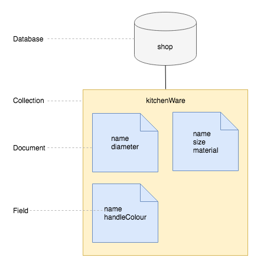
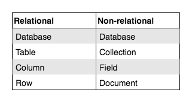
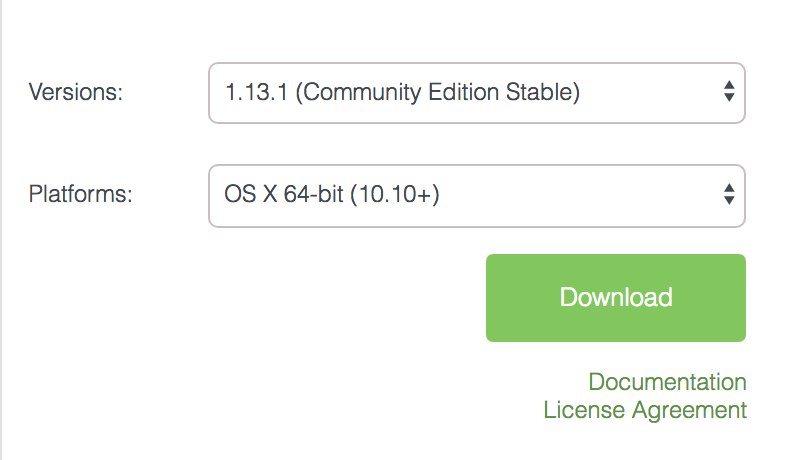

# Intro To MongoDB

**Lesson Duration: 45 minutes**

## Learning Objectives
- Understand what a non-relational database is
- Be able to create a MongoDB database
- Be able to create a collection
- Be able to create a document
- Be able to select all documents in a collection

## Introduction

## Relational Verses Non-relational

Databases allow us to organise and store collections of data. Relational databases (such as MySQL and PostgreSQL), have a schema that define tables with columns and rows. Relationships between the tables are created with the use of primary and foreign keys.

There are cases where our data does not fit well into a relational model, for example, if our collection contains objects with different properties, or the same property has values of different datatypes. In these cases a non-relational database might be more appropriate. Non-relational databases are also referred to as 'NoSQL' due to the fact they do not require SQL for queries.

We are going to be using a open-source, non-relational database called MongoDB. MongoDB takes its name from the word 'humongous' and was designed for storing huge amounts of non-relational data. We will be using JavaScript to query it and as it stores data in collections of JSON-style, key-value pair documents, it is ideal for storing JavaScript objects.

## Non-relational Data

Let's take a look at an example of non-relational data. If a shop stocks products, even within the specific category 'kitchenware', each product might have an entirely different set of properties.

```js
const kitchenware = [
  {
    name: 'frying pan',
    diameter:	28
  },
  {
    name: 'chopping board',
    size:
      {
        width: 20,
        length: 18
      },
    material: 'wood'
  },
  {
    name: 'whisk',
    handleColour: 'red'
  }
]
```

There is no obvious way of organising this data into separate tables, so if we were to try and store this data in a relational database, we would need a column for each property (name, diameter, size, material, handle colour). As each product would only have values for some of the columns, there would be a lot of nulls in the database.

## MongoDB

MongoDB is a document-oriented database. Instead of having tables with columns and rows, it stores data in collections of JSON documents.



*Diagram of non-relational database*

We can see from this diagram that with a non-relational database, we don't have the problem of every kitchenware product having a `handleColour` property, as each object is stored as a document and there are no tables or columns. Instead it has collections of documents and each document has the properties that it requires.



*Terminology to describe the component parts of relational and non-relational databases*

## MongoDB from the Command-line

Before we do anything, we are going to start a MongoDB server on our machine using a command line application called `mongod`. We need to have this running while interacting with our databases.

```bash
mongod
```

> Note: When we are not using mongoDB, we should kill the server process with `ctrl` + `c` before closing the terminal window, otherwise it will continue to run in the background.

We will be using JavaScript to talk to MongoDB, so there is no need to learn additional querying languages. We are going create a database with the following structure:

- Database name: 'shop'
- Collection name: 'kitchenware'
- Document: A product with the following properties:
  - name: knife
  - lengths: [15, 20, 25]

Often we will be interacting with MongoDB from our JavaScript applications, but we can also interact with it from the command line. In this lesson we will start by looking at the create and read operations from the command-line, before looking at MongoDB's GUI and running the commands from a file.

### Create and Connect to a Database

Start by opening a new terminal window (the mongod server should still be running in a separate window) and enter the mongo shell.

```bash
mongo
```

We will use the mongo shell command `use`, followed by the name of the database, to connect to the database if it exists. If it doesn't, this command will create the database with the specified name and connect to it.

```bash
use shop
```

We are now connected to the database, 'shop'. We have access to a `db` object, which has all the methods that we need to create collections and to create, read, update and delete documents.

### Creating a Collection and Inserting a Document

We currently don't have any collections in the shop database. We can create a collection and insert a document into it with one command.

We will create a kitchenware collection and insert a document that represents a product (a knife) into it. We use the database object, `db`, access the collection name, `kitchenware`, and call `insertOne`, passing it the JSON object we want to insert. The  [`insertOne`](https://docs.mongodb.com/manual/reference/method/db.collection.insertOne/#db.collection.insertOne) method allows us to insert one document into a collection. If the collection doesn't exist yet, the `insertOne` method will first create it, then insert the document into it.

```js
db.kitchenware.insertOne({ name: "knife", lengths: [15, 20, 25] });
```

> Note: Because we are inserting a JSON document, we are able insert an object with nested collections.

You'll notice the following output:

```js

{
	"acknowledged" : true,
	"insertedId" : ObjectId("5aec44ed5c7007170f5fe99a")
}
```

This is telling us that MongoDB has successfully inserted the document into the collection, and that it has given the document an id of '5aec44ed5c7007170f5fe99a'. This is the document's unique identifier.

### Reading from the Database

Let's now retrieve the documents in the kitchenware collection using the `find` method. Again, we use the database object, `db`, access the collection, `kitchenware`, and call the method on the collection.

```js
db.kitchenware.find();
// -> {
//   "_id" : ObjectId("5aec44ed5c7007170f5fe99a"),
//   "name" : "knife",
//   "length" : [ "trout", "seal" ]
// }
```

The `find` method gives us back all the documents in the collection.

## MongoDB Compass GUI

We can use MongoDB's GUI to more easily view the state of our database. You can download the free community edition from [https://www.mongodb.com/download-center?jmp=hero#compass](https://www.mongodb.com/download-center?jmp=hero#compass)



*Download settings for MongoDB Compass*

Once you have downloaded MongoDB Compass, open it and click "Connect". Down the left-hand side you will see the list of databases. If you click on a database you will see any collections inside it, and inside the collection, any documents and their fields.

### MongoDB From a File

We can also define our database and seed it with data in a JavaScript file and run it using the mongo shell. Let's do that now.

```sh
touch mongo_play.js
```

We will start by using MongoDB's shell commands to create and switch to a database called zoo.

```js
// mongo_play.js

use zoo;
```

And as this is a seeds file, we will drop the database to it is cleared each time. Just like when we were working from the command-line, now we are connected to the zoo database, we have the `db` object available to us.

```js
// mongo_play.js

use zoo;
db.dropDatabase(); // NEW
```

Now let's insert some animal objects into an animals collection, using the `insertOne` method, that we pass the object that we want to insert. If there is no animals collection, `insertOne` will create one and insert into it.

```js
// mongo_play.js

db.animals.insertOne({
  name: "Janet",
  type: "Polar Bear"
});

db.animals.insertOne({
  name: "Norman",
  type: "Capybara",
  age: 5
});

```

> Note: Because MongoDB is a non-relational database, we can insert entries with different fields without any problems.

Let's run that file.

```sh
mongo < mongo_play.js
```

And now if you refresh MongoDB Compass (using the button in the top left corner of the GUI), you will see a database called zoo with two animals inside.

Lastly if we want to delete an entry, we can use the `deleteOne` method that takes a query object. It will delete the first document that matches the query (in our case, the first document with a `name` field with the value of "Janet").

```js
// mongo_play.js

db.animals.insertOne({
  name: "Janet",
  type: "Polar Bear"
});

db.animals.insertOne({
  name: "Norman",
  type: "Penguin",
  age: 5
});

db.animals.deleteOne({ name: "Janet" });
```

Now if you run the file again, and refresh MongoDB Compass, you will see that there is only one animal, Norman, in the zoo database.

## Recap

What makes a database non-relational?
<details>
<summary>Answer</summary>
- It doesn't have tables with columns that have relationships. Instead it stores documents in collections.
- It doesn't require SQL to query it.
</details>

What command did we use to create and connect to a MongoDB database?
<details>
<summary>Answer</summary>
`use`
</details>

Once connected to a MongoDB database, how do we reference it when we want to interact with it?
<details>
<summary>Answer</summary>
`db`
</details>

What command did we use to create a collection and insert a document into it?
<details>
<summary>Answer</summary>
`insertOne`
</details>

## Conclusion

Databases allows us to organise collections of data and access data efficiently. Non-relational data is data that doesn't fit easily into a relational schema, tables with columns and rows. If your data model is non-relational, you may decide to use a non-relational database, such as MongoDB, which stores data as JSON documents in collections. To query a MongoDB we can use JavaScript.
