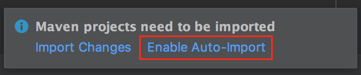

# Intro to Spring and Spring Boot

**Lesson Duration: 30 - 45 minutes**

### Learning Objectives

- Understand what Spring and Spring Boot are used for
- Know some of the things you can do with Spring
- Be able to select some dependencies and generate a new Spring Boot project

## Introduction

Spring is a framework for back-end web application development. It can be viewed as an "umbrella" framework, as it allows you to easily make use of many different technologies across a standard of Java technologies.

**Why are we learning this?**
Spring is widely used, it is the go to framework in Java for creating web applications.

**What problem are we trying to solve?**
When we are building back end applications in Java, we often want to do similar tasks that require a lot of code, such as building web servers, writing controllers, defining routes and more. Because developers often want to do these things in the same way, spring has been written in such a way that helps programmers achieve these tasks while writing as little code as possible.

By the end of this week you will be able to use Java with Spring to:

- Easily create back-end web applications that persist objects to databases
- Use RESTful routes to GET POST PUT and DELETE those objects from the database
- Create a RESTful API with additional custom routes

### What is Spring?

Spring is a framework for back-end web application development. It can be viewed as an "umbrella" framework, as it allows you to easily make use of many different technologies across a standard of Java technologies.


### Task: (5 minutes)

Visit the [Spring Reference Docs](https://spring.io/docs/reference) to view a list of Spring's projects. A Spring projects can be installed as dependencies and they gives Spring additional functionality.

Look at the list and see if you can identify any projects that would help with previous functionality you have built in you applications.

> Objective: Get students excited about the many different things you can do with Spring!

Previously when building application we have been building a lot of this functionality manually:
1. We have been mapping our objects to databases using SQL statements with the objects properties defined as columns.
2. We have been creating controllers that define a set of RESTful routes
3. We have been writing methods that read/write to databases to create CRUD functionality.

These things are all going to be done for us by using these spring projects. We are going to be using the following the Spring projects:

- **Java Persistence API** & **PostgreSQL** for reading/writing to a database to persist objects. We will no longer have to manually map our objects properties to database tables, or write the methods that implement the CRUD functionality.
- **Spring Framework** to help us create controllers
- **Spring Data REST** for Building RESTful services, so that we do not need to define the restful routes, or the conventional behaviour for those restful routes

We will get all of the above functionality out of the box.

## Spring Boot

As Spring is such a large framework it can be difficult navigating its features. It can also be time consuming handling the Spring configuration when starting a new project. This is where [Spring Boot](https://spring.io/projects/spring-boot) comes in. Spring Boot is a project that's part of Spring that allows us to create Spring Projects really easily.

Spring Boot offers:

- Some API's and libraries that make building some services easier
- A generator tool to "bootstrap" our project when creating a new Spring Project

### Using Spring Boot "initializr" to Initialise a Project

Spring Boot Initializr is a starter tool for beginning Spring based projects. As Spring is huge, Spring Boot Initializr allows us to generate the boilerplate code for a project, with any dependencies we choose already installed. In industry, the Spring Boot Initializr (some times referred to as spring generator), is widely used to bootstrap projects.

- Go to [https://start.spring.io/](https://start.spring.io/)
- Search and add: **Web**, **Dev Tools**, **PostgreSQL** and **JPA**
- Provide the group - 'com.codeclan.example'
- Provide the artefact name - 'pirateservice'
- Click "Generate Project" and the zip will be downloaded

The dependencies we have just installed for this project are:

- **Web** - allows us to do RESTful routes and create controllers
- **Dev Tools** - makes building spring a little easier with things like automatic reloading
- **PostgreSQL** - gives us the correct "bindings" to work with Postgres, i.e to connect to a Postgres database.
- JPA - **Java Persistence API** Gives us the power to use Java to "persist" our objects to the database using Hibernate.

The .zip file given to us by Spring Boot Initializr contains a pom.xml file, and some very simple boiler plate Java code.

### pom.xml + Maven

Each dependency we chose on the "initilizr" is put into the `pom.xml` for us. This is why Spring Boot "initilizr" is so useful. `pom.xml` describes the dependencies by listing libraries we want to download and install to build and run that project.

Maven is a build system for Java, just like Gradle. Build systems like Maven and Gradle are responsible for compiling or "building" multiple source files of code into a single application. Keep in mind that Java is a compiled language, meaning that the `.java` files are compiled into a machine language. Build systems, like Maven make the act of building multiple files and bringing in dependencies significantly easier.

Our `pom.xml` is describing to Maven what dependencies we want.

### IntelliJ + Maven

IntelliJ can open up Maven based projects. Luckily this is what was generated and given to us by the Spring Boot Initializr online tool.

Unzip the file to somewhere in coursework and open the folder containing the `pom.xml` with IntelliJ. IntelliJ will ask if you want to enable the automatic import of Maven projects and you can select 'Enable Auto-Import'.



*Screenshot of Enable Auto-import Window*

### Point to the Database

As part of this application, we will want to read and write objects we create to the database. To do this, we need to tell Spring where the Database is.

#### application.properties

When using spring, a lot of the applications "static configuration" - this means config settings we will not want to change while our app' runs - will need to be set in one common place where Spring can find it. This is what the `application.properties` file is for.

Find the initially empty `application.properties` file in the `resources` directory - src / main / resources - and paste in the following:

```
spring.datasource.url = jdbc:postgresql://localhost/pirateservice?useSSL=false
spring.jpa.properties.hibernate.dialect = org.hibernate.dialect.PostgreSQLDialect
spring.jpa.properties.hibernate.jdbc.lob.non_contextual_creation=true

spring.datasource.username = postgres
```

This points spring to a database `pirateservice` running on localhost, sets the dialect to understand Postgres Database types and allows us to use "Hibernate" which is a library for helping us manage database access.

#### Create Database

With your postgres server is running, you will need to create the 'pirateservice' database with postgres:
```sh
createdb pirateservice -U postgres
```

> If the `postgres` user doesn't exist, you can
* Create a user with `createuser postgres`
* Jump into psql with `psql`
* Type `ALTER USER postgres WITH SUPERUSER` to give it enough permission to create databases

### Java 10 Compatibility

Since we are likely using Java10 - we need to add a dependency for compatibility with that manually. Find `pom.xml` and add the following within the `<dependencies>` section:

```
<dependency>
	<groupId>javax.xml.bind</groupId>
	<artifactId>jaxb-api</artifactId>
	<version>2.3.0</version>
</dependency>
```

Note: that must be put between both `<dependencies>` tags.

### Running Spring Applications

Even though our application does nothing at the moment, we can run this bare-bones application. Find `PirateserviceApplication.java` in src / main / java / com / example / pirateservice.

The class `PirateserviceApplication` is special as it contains the `main()` method. Note that this was already written for us, and that it's already been populated with some code:

```java
SpringApplication.run(PirateserviceApplication.class, args);
```

This tells Spring to start, but does nothing else. For the most part that's all we really need in here. This is because of the way Spring works, we launch it, and then ask it to find our code in other ways.

Run this. Everything has worked if the application runs and doesn't exit then displays the following at the end of a lot of logging output:

```
Tomcat started on port(s): 8080 (http) with context path ...
Started PirateserviceApplication in 5.663 seconds (JVM running for 6.615)
```

We are now ready to start building a Spring Application. This will be done over the next few lessons.

## Recap

- Spring is a framework for building large and small web application allowing you to make use of potentially many different applications
- Spring Boot allows us to start Spring applications easily. We choose what we want to build, and this start generator makes a project with a `pom.xml` (maven dependencies file) which is pre-filled with the list of dependencies. It is used much like generating a new project in IntelliJ.

# Next Lesson
[Annotating Classes](../annotating_classes/annotating_class.md)
