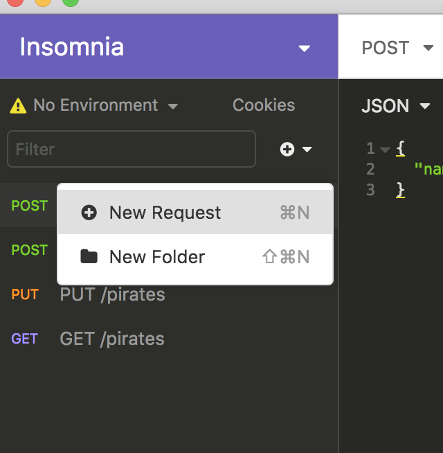
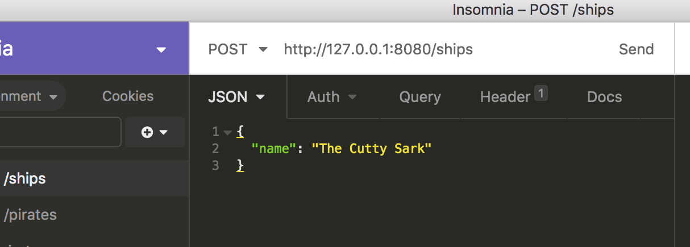

# Insomia + POSTing data
**Lesson Duration: 30 minutes**

### Learning Objectives


# Introduction
**Why are we learning this?** When developing API's we need to be able to test POSTing to the API endpoints given to us by Spring Data REST.

**By the end of this lesson you will be able to** Use Insomia to POST to API endpoints that have relationships.


## POSTing related objects
Using Insomia, we can POST to create new entries against a particular collection.

When posting to a collection that has a related model, the related model needs to exist first.

For example, with `Pirate`s and `Ships`, the related ship needs to exist first, before the `Pirate` can be created. This is expected when creating these objects in Java only, where `Pirate` constructor takes a `Ship` instance as one of the arguments.

**The JSON**
The JSON for a Ship will look like:

```json
{
	"name": "The Cutty Sark"
}
```

The response will then show which ID that has been saved to if it's succesful.

```json
{
	"name": "The Cutty Sark",
	"_links": {
		"self": {
			"href": "http://127.0.0.1:8080/ships/3"
		},
		"ship": {
			"href": "http://127.0.0.1:8080/ships/3"
		},
		"pirates": {
			"href": "http://127.0.0.1:8080/ships/3/pirates"
		}
	}
}
```

Now a Pirate that's in "The Cutty Sark" can be posted:

```json
{
	"firstName": "George",
	"lastName": "Captainman",
	"age": 50,
	"ship": "http://localhost:8080/ships/3"
}
```

Pay attention to the `ship` property. It needs to have the link to related ship as a fully qualified URL.

## Using Insomnia

### New Request

To use Insomia, first add a new request by selecting the ➕ 🔽 icon, and choose "New Request". 



Enter the URL and then the JSON body. Choose the type of request on the drop-down to the left of the URL bar. **Choose POST**.



Click send to make the POST request.


## Summary
We learned how to use Insomia to POST to API endpoints that have relationships.
