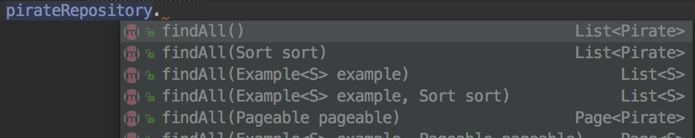
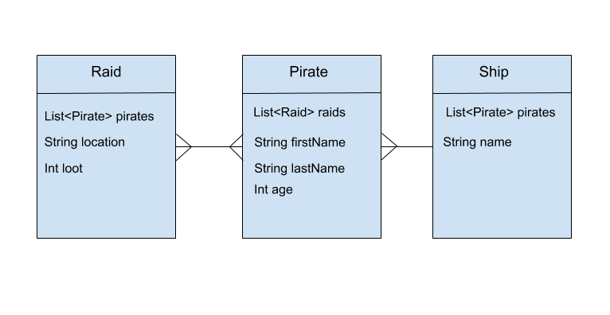
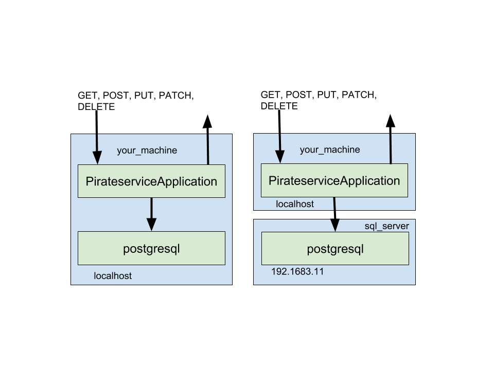

# Criteria Queries on Relationships - One to Many

**Lesson Duration: 60 minutes**

### Learning Objectives
- Understand the power of Hibernates criteria queries and when to use them
- Be able to build criteria queries for One to Many

# Introduction
**Why are we learning this?** Relational databases are great for storing data and preserving its structure. Quite often, when trying to get data we rely on that structure.

For example. We might say *"I've got this object, 'Shop'. Give me all of the 'Product' items in the shop"*

This type of query is extremely *relational* in that we are relying on the relationship to get the wanted data.

**What problem are we trying to solve?** Getting data by making queries on models which have one-to-many relationships.

**By the end of this lesson you will be able to**
Write some criteria queries to get data from related models.


## Building A Criteria Query

Lets put together a query for getting all the `Pirate`s for a given `Ship`.

### Prepare the classes and interface
As mentioned in the last lesson, the `JpaRepository` needs to be specialised in order to build custom queries beyond the ones provided by `JpaRepository`.

As a reminder, we can do that by creating a second interface `ShipRepositoryCustom` and a class `ShipRepositoryImpl`.

`ShipRepository` should now extend both `JpaRepository` and `ShipRepositoryCustom`.

From here on, this query will be implemented in the `ShipRepositoryImpl`, which should implement the interface `ShipRepositoryCustom`.


### Know what data you already have

When doing any sort of query, whether it be with or without Spring or Hibernate - one thing is always true.
**You always have some data to get started**.

Consider the following examples in SQL:

* `SELECT * from pirates;`, data we have is that we know to query `pirates` table.
* `SELECT * from pirates WHERE name ='Long John';` we have the `name` and that we're querying the pirates table
* `SELECT * from pirates WHERE name ='Jack' AND age = 30`. We have `name` and `age`, as well as that we are querying the `pirates` table.

Knowing that there's always a start point will help us construct queries easier.

Our start point is that we have a `Ship` meaning we can build   a query method that takes a `Ship`. For now, name it `myQuery`, place this in `ShipRepositoryImpl.java`

```java

public void myQuery(Ship ship){

}
```

###  Know what data you want back

It may seem obvious, but knowing exactly what you want is extremely important. Some things to consider when figuring out what you want that will make things easier:

- Do you want a List of a particular object?
- Do you want just **one** of a partular object?
- Do you want a primitive type back - such as a String, Integer or Boolean?


The question on whether we want a scalar (just one of an object) or a vector (a list) **depends on the uniquness involved in the query**.

#### Uniquiness
Uniqueness of a queriy depends on whether a unique id like the `id` property of a model was used to construct the query or if some non-unique properites are being used to build it like "first name", "last name", "age", "date of birth". These kinds of things are properties which potentially many could share.

##### Unique
When building a query with known unique identifiers like the id, or some other known key we then also know that there will only be one value, rather than a list of values, returned.


##### Non-unique

When building a query with non-unique properites, then it's best to save the results of the query as a list.


Since we're getting **all** the `Pirate`s for a given `Ship`, it's a `List` of `Pirate` we want back. This is very much a non-unique query. The method should therefore return a `List<Pirate>`.

Update the code by removing `void` and adding the return type. Also, we know a List of `Pirate` should be returned,  a variable called `results` set to null is what we will put the result of the query into eventually.

```java

public List<Pirate> myQuery(Ship ship){
 List<Pirate> results = null;
 
}
```


### Naming 

**It's a good idea** to give queries a name that makes sense to other developers. Imagine a developer you've never met is in IntelliJ and they've just dependency injected your `PirateRepository` and have typed `pirateRepository.`.



At that point, they are looking through all the amazing things `PirateRepository` can do, with the help of IntelliJ. It's important the method they want has a really obvious name.

Lets use `findAllPiratesForShip()` as our fantastic method name. This is really good since it:

* gives an action "find"
* Implies we're getting a list of something with "All"
* Gives the type of the list with "Pirates"
* Explains **what we are giving it** with "ForShip" - implying that this method will take an argument of type `Ship`.

Update our method again:

```java
public List<Pirate> findAllPiratesForShip(Ship ship) {

}
```

###  Use the relationships 
Put together a plan based on your knowledge of the relationships. Relational databases are good becuase the relation helps you get the data.




Make use of that data we already **have** then find the shortest route to the data we're **trying to find**.

This may need to be repeated depending on the query, if for example, we wanted all ships that went on all raids. In which case we'd almost definately need to check for duplicate results and factor that in.


With the above structure in mind, consider the following scenarios. Try to think about how these would be solved in code only, by identifying what we **already have**, **want back from the query** and strategy on how it would be solved in code.

1. Get all Ships that went on a particular raid
2. Get all the Pirates that went on a particular raid
3. Get all the Pirates that went on a parcicular raid and were on a particular ship
4. Get the pirate with a specific name who went on a particular raid

<details>
<summary>Solution</summary>

1. Get all Ships that went on a particular raid
  - **Already have:** the raid instance
  - **Want back:** a list of ships
  - With the raid, get the list of pirates. With each pirate get their Ship.
2. Get all the Pirates that went on a particular raid
  - **Already have:** the raid instance
  - **Want back:** a list of pirates
  - With the raid, get all the pirates.
3. Get all the Pirates that went on a parcicular raid and were on a particular ship
  - **Already have:** the raid instance and some data about the ship
  - **Want back:** a list of pirates
  - With the raid, get all the pirates. Check if each were on the given ship. Repeat for each pirate on each raid adding found pirates to a list.
4. Get the pirate with a specific name who went on a particular raid
 - **Already have:** the raid instance and a pirates name
  - **Want back:** a single pirate - but may be a list since name is non-unique
  - With the raid, get all the pirates. Check each pirate's name to find the one we want.

</details>

For our query we can identify:

Get all `Pirate`s for a given `Ship`.

- **Already have:** Ship
- **Want back:** list of pirates
- With the Ship, find the list of pirates


### Obtain the EntityManager
In standard Java Persistence libraries which we are using `javax.persistence`, there is an EntityMangager responsible for giving access to the Models (our annotated classes). This `EntityManager` can give us access to the Hibernate `Session` object, which simply allows us to read and write to the database.

Spring makes obtaining the `EntityManager` relatively simple by allowing it to be dependency injected.

We can do this in our Repositroy class:
 
```java
   @Autowired
   EntityManager entityManager;
```

### Obtain the Hibernate Session 
Using the `entityManager`, which is a standard Javax persistence class, we can ask it to give us an instance of a class from the provider-specific API. In our case this provider-specific API is Hibernate, and we want to get hold of the `Session` to do criteria queries.  So we do:

```java
public List<Pirate> findAllPiratesForShip(Ship ship) {
   Session session = entityManager.unwrap(Session.class);  // NEW
}
```
> Note: `Session` from `org.hibernate` is the one we want when importing the class in IntelliJ.

`unwrap()` asks JPA to give us Hibernate's `Session`.

### Create a new Criteria

**Hibernate** allows us to create a `Criteria` object that we can use to construct a query in code.

A `Criteria` needs to be created for a particular model class, so it knows how to query it and where to begin. We use the "session" to create a new `Criteria` object. 

```java

@Autowired
EntityManager entityManager;
 
public List<Pirate> findAllPiratesForShip(Ship ship) {
	Session session = entityManager.unwrap(Session.class);
	Criteria cr = session.createCriteria(Pirate.class); //NEW

}

```


### Restrictions

Now that we have a `Criteria` `cr`, it's possible to add various `Restrictions` to the criteria.

For example, if we were to check `Raid` has location `"Tortuga"`:

```java
Criteria cr = session.createCriteria(Raid.class);
cr.add(Restrictions.eq("location", "Tortuga"));
```

A Restriction on the criteria is much the same as using another condition in an SQL statement like:

```sql
SELECT * FROM raids
WHERE condition1
AND condition2
AND condition3
```

Just like in SQL, we can add as many conditions or restrictions as we wish. It's simply a matter of adding more `cr.add();` calls containing restrictions.

Restrictions have many methods to allow us to compare properties of a model when building a query. For example

- To get records having age **eq**ual to 30

```java
cr.add(Restrictions.eq("age", 25));
```

- To get records having age more than 25

```java
cr.add(Restrictions.gt("age", 25));
```

- To get records having age less than 25

```java
cr.add(Restrictions.lt("age", 25));
```

- To get records having fistName starting with jac

```java
cr.add(Restrictions.like("firstName", "jac%"));
```

- Case sensitive form of the above restriction.

```java
cr.add(Restrictions.ilike("firstName", "Jac%"));
```

- To get records having age in between 25 and 35

```java
cr.add(Restrictions.between("age", 25, 35));
```

A full list is available on the [Hibernate documentation](https://docs.jboss.org/hibernate/core/3.3/api/org/hibernate/criterion/Restrictions.html).

**For our purposes** we need to query `Pirate` to check the `ship` property matches the one passed into the query method.

```java

@Autowired
EntityManager entityManager;
 
public List<Pirate> findAllPiratesForShip(Ship ship) {
	Session session = entityManager.unwrap(Session.class);
	Criteria cr = session.createCriteria(Pirate.class); 
	cr.add(Restrictions.eq("ship", ship));  // NEW
}

```

### Get Query Result

As with the method, the query result depends on whether we are getting back a scalar (one unique result) or a vector (a list of results).

#### Unique result
The `Criteria` object `cr` has a `uniqueResult()` method which does just that. `uniqueResult()` returns an object of type `Object` meaning we need to remember to cast it to the type we want.

```java
result = (Pirate)cr.uniqueResult();
```

#### Non-unique Result

The `Criteria` object `cr` has a `list()` method which gives a `List<>` of our objects

```
   results = cr.list();
```

In our case, we've already decided it's a `List` of `Pirate` we want back, so use `cr.list()`

```java
@Autowired
EntityManager entityManager;
 
public List<Pirate> findAllPiratesForShip(Ship ship) {
	Session session = entityManager.unwrap(Session.class);
	Criteria cr = session.createCriteria(Pirate);
	cr.add(Restrictions.eq("ship", ship));  
	result = cr.list();   // NEW
	return result;       // NEW
}
```

### Catching Errors

Most databases run on a separate process entirely from the application that's using it either on the same computer, or separate computers that are networked together. 

The left side represents the `PirateserviceApplication` running on the same computer as the postgresql database. On the right, they are running on different computers.

**In both situations** because we need to connect to the database, the database itself is external to the application. Ultimately this means that databases should be treated the same way that all "I/O" is treated in computing.


#### What is I/O?
**I/O** is short for input and output. In computing terms, it means when data is read and written to an external resource outside of the application or to the outside world.

What's external:

* Users
* Hardware devices like Monitors, Keyboards, Mice, Disk drives, Wifi/Network cards
* Other programs and software

Reading and writing to I/O is an extremly important part of computing that's taken for granted. Importantly it's the bottleneck that's **most likely to have something go wrong.** And even more notably, **it's our responsibility to handle cases of I/O going wrong**.

#### Handling problems with try / catch / finally
Most programming languages have a mechanisim for handling situations (commonly with I/O) that might go wrong. This is through the `try` + `catch` system.

In Java `try` and `catch` are keywords built into the language. `try` allows us to encapsulate a block of code that we believe to have a risk of not working correctly because of some external factor like  the I/O device being disconnected or not being available. 

```java
try {
// Code in here is risky or is not gaurenteed to work
}
```

The `catch` keyword needs to come immediately after the try block. `catch` means if things definately do go wrong from the `try` block for whatever reason, then execute the code in the `catch` block.
More technically, `catch` "catches" an `Exception` if one is created when doing the actions of the `try`, and we can gain access to that `Exception` in the catch block by passing it in.

```java
..
catch (Exception ex) {

}
```

In situations where we want to say "no matter what happens, always do the following", then we can also use a `finally` block.

Putting it all together we have:

```java

try {
// Call something that's at risk of not working - like an I/O read or write
} catch (Excepton ex) {
// The read or write didn't go as planned and 'threw' an exception. 
// We now have access to the ex object to tell us more about what went wrong
} finally {
// If it all goes well, or if it all goes badly, no matter what, call the finally. Finally is optional.
}
```


## Try / catch in our query

Since we are using the hibernate `Session` object to indirectly access the database and this is an I/O operation, this should be protected with `try`/`catch`. The `finally` block should be used to close the session.

For our query, we now have:

```java
@Autowired
EntityManager entityManager;
 
public List<Pirate> findAllPiratesForShip(Ship ship) {
    List<Pirate> results = null;
    Session session = entityManager.unwrap(Session.class);

	try {
		Criteria cr = session.createCriteria(Pirate);
		cr.add(Restrictions.eq("ship", ship));  
		result = cr.list();  
	} catch (HibernateException ex) {
		ex.printStackTrace();
	} finally {
		session.close();
	}
	return results;
}
```
The `findAllPiratesForShip()` method can now be used anywhere we've injected a `PirateRepository`.


# Summary
- We now have some understanding of how to think about building queries in terms of knowing what it should be given and return.
- We know how to use the relationship to help build a strategy for a query.
- We can get hold of the `EntityManager` and then `Session` object as is required to build a `Criteria` query object.
- We can build up a `Criteria` query with restrictions.
- We understand `try`/`catch` and the importance of using it with I/O operations.
- Understand the power of Hibernates criteria queries and when to use them
- Now able to build criteria queries for One to Many