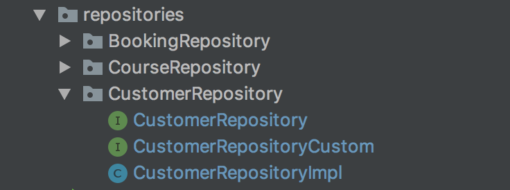
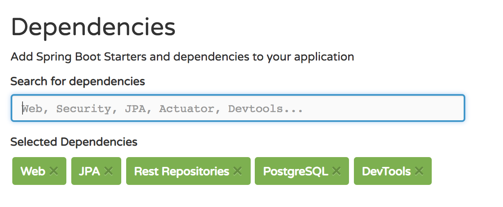

# All Day Lab - Build a Course Booking System

## Intro

For this lab, we will build a simple course booking back-end. At the end of the lab we should have a RESTful API that allows connected clients to create course bookings and find useful information about the bookings created.

The API should be built from scratch with Spring using Spring Boot Initialiser.


## MVP

### Models
The course reservations API needs to be built with three models with the following properties:

* Course
  * name - the name of the course eg: Intro to Python
  * town - the town/city/village where the course is located. We will not bother with full address yet.
  * star rating - Out of 5, each course has a rating
* Booking
   * date - a **string** in the form "dd-mm-yy" for the booking date. Dates can be in the future or in the past

* Customer
   * name - **string** containing customer's name
   * town - a **string** containing the town where the customer lives. We will not record an address at this stage
   * age - the customers age. Useful for marketing purposes

The relationships should be:

* A Course has many Bookings
* A Booking has a Course
* A Customer has many bookings
* A booking has a customer

### Queries + Custom Routes

The basic CRUD aspects of the normal RESTful routes should be enabled with Spring Data REST. However there are a few specific routes that **should be implemented and connected to custom criteria queries**. These are:

* Get all courses with a given rating
* Get all customers for a given course
* Get all courses for a given customer
* Get all bookings for a given date


## Extensions


### Extension Queries + Routes

* Get all customers in a given town for a given course
* Get all customers over a certain age in a given town for a given course

### Extension Other
* Correctly handle case-insensitive routes with Spring RestController


## Tips / Reminders


* Clearly understand the relationships before coding.
* Be careful with `town` property - consider how to handle caps
* Write tests for your queries
* Use a ddl-auto setting of `create-drop` when doing development. This means every time the app starts, the schema is created, and when the app stops the schema is destroyed.
* Use packages for each repository type. For example, all Course repositories should go in the same package called CourseRepository

* Reminder on which dependencies to use with spring Initialiser 
* Remember to add this dependency in your pom.xml

```xml

<dependency>
    <groupId>javax.xml.bind</groupId>
    <artifactId>jaxb-api</artifactId>
    <version>2.3.0</version>
</dependency>

```
