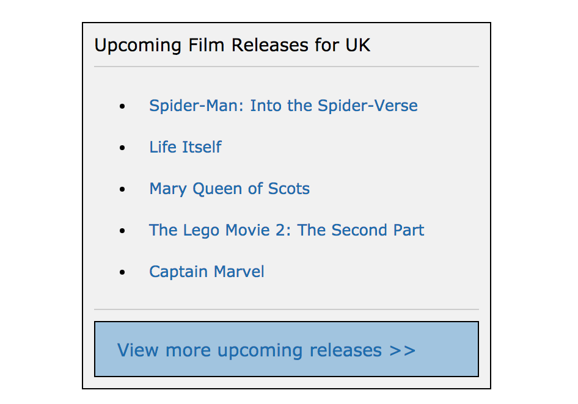

# React: Film Releases

## Reading

Thinking In React (20 mins) https://facebook.github.io/react/docs/thinking-in-react.html

## Practice

You task is to plan and build an application that displays a list of upcoming film titles, each one linking to their [imdb](https://www.imdb.com/) page.


*Screenshot of example result*

- Draw out the UI on paper, breaking it down into components.
- Draw a component hierarchy diagram, noting down any state and props for each component.
- Implement the application in React.

Note: The 'View more upcoming releases' button can link to the imdb calendar page - [https://www.imdb.com/calendar/?region=gb](https://www.imdb.com/calendar/?region=gb)

### Data

You can use the following data to display in your application:

```js
[
  {
    id: 1,
    name: "Spider-Man: Into the Spider-Verse",
    url: "https://www.imdb.com/title/tt4633694/?ref_=rlm"
  },
  {
    id: 2,
    name: "Life Itself",
    url: "https://www.imdb.com/title/tt5989218/?ref_=rlm"
  },
  {
    id: 3,
    name: "Mary Queen of Scots",
    url: "https://www.imdb.com/title/tt2328900/?ref_=rlm"
  },
  {
    id: 4,
    name: "The Lego Movie 2: The Second Part", url: "https://www.imdb.com/title/tt3513498/?ref_=rlm"
  },
  {
    id: 5,
    name: "Captain Marvel",
    url: "https://www.imdb.com/title/tt4154664/?ref_=rlm"
  }
]
```
