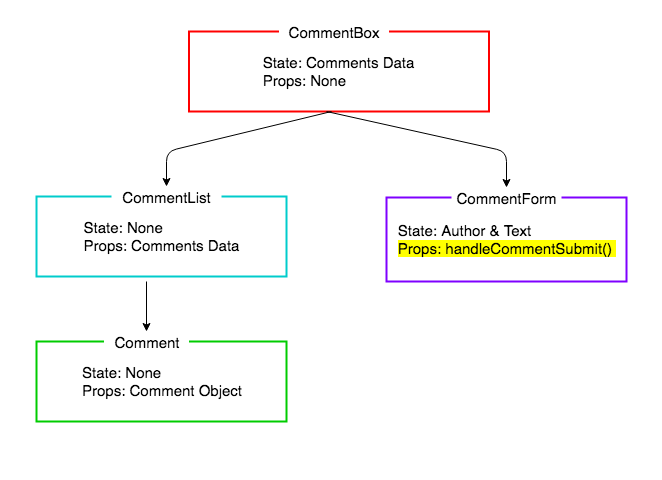

# React Comments Form

## Learning Objectives
- Be able to add a form to a React component
- Be able to pass callbacks between components as props
- Know how and when to trigger a components render method

## Introduction

In the previous lesson we made a static application that renders a list of comments. Now let's look at how we can update our list with a new comment submitted by a user. To do this we need to alter the state of our application when the new comment gets submitted, causing a rerender.

## Adding new Comments

We are displaying the comments nicely. Now we would like to be able to add comments. Let's create a form component:

```bash
touch src/components/CommentForm.js
```

Let's create a form with author and text fields. The JSX syntax is again, very similar to the HTML syntax for a form.

```js
// src/components/CommentForm.js

import React, { Component } from 'react';

class CommentForm extends Component {
  render() {
    return (
      <form className="comment-form">
        <input
          type="text"
          placeholder="Your name"
        />
        <input
          type="text"
          placeholder="Say something..."
        />
        <input type="submit" value="Post" />
      </form>
    )
  }
}

export default CommentForm;
```

And let's import `CommentForm` in `CommentBox` and tell our `CommentBox` to render the form

```js
// src/containers/CommentBox.js
import React, { Component } from "react";
import CommentList from "../components/CommentList";
import CommentForm from "../components/CommentForm"; // NEW

// ...

render() {
   return (
    <div className="comment-box">
      <h2>Add a Comment</h2> // NEW
      <CommentForm /> // NEW
      <h2>Comments</h2>
      <CommentList data={this.state.data} />
    </div>
  )
}

```

## React Controlled Components

React documentation suggests that when we are creating a component that contains user inputs, such as a form, it should have state that keep's track of the values of the inputs. This might seem odd, as we have been working to the principle that all the state lives at the top of the application, but this is an exception. The form component will keep track of its own state.

[link to React Controlled Components](https://facebook.github.io/react/docs/forms.html)

The idea is that the form component has state reflects the current state of the inputs, and this state is the single source of truth for the whole component. Anywhere we need to access the values of the form, we access them from the state.

So let's set that up in the constructor.

```js
// src/components/CommentForm.js

class CommentForm extends Component {
  constructor(props) { // NEW
    super(props);
    this.state = {
      author: '',
      text: ''
    };
  }

  // ...
}

```

We can now set up the form to display those state values.

```js
render() {
<form className="comment-form">
  <input
    type="text"
    placeholder="Your name"
    value={this.state.author} // NEW
  />
  <input
    type="text"
    placeholder="Say something..."
    value={this.state.text} // NEW
  />
  <input type="submit" value="Post" />
</form>
}

export default CommentForm;

```

So now when we look at the page, when we type in the fields the values don't change. This is because they are always displaying the state, which isn't being updated. Let's now update the state as the user types.

We will write two functions, one for updating 'author' and the other for updating 'text'. Then we will pass these functions to the `onChange` event of the inputs. This means as the user types, the inputs' `onChange` event will be fired, and the state will be updated.

```js
// ...

handleAuthorChange(event) { // NEW
  this.setState({author: event.target.value});
}

handleTextChange(event) { // NEW
  this.setState({text: event.target.value});
}

render() {
  return (
    <form className="comment-form">
      <input
        type="text"
        placeholder="Your name"
        value={this.state.author}
        onChange={this.handleAuthorChange} // NEW
      />
      <input
        type="text"
        placeholder="Say something..."
        value={this.state.text}
        onChange={this.handleTextChange} // NEW
      />
      <input type="submit" value="Post" />
    </form>
  )
}

```

If we now check that in out browser, we should see an error. That's because the handle change functions have the wrong context. So let's bind them in the constructor to fix this.

```js
// src/components/CommentForm.js

constructor(props) {
  super(props);
  this.state = {
    author: '',
    text: ''
  };
  this.handleAuthorChange = this.handleAuthorChange.bind(this);
  this.handleTextChange = this.handleTextChange.bind(this);
}

```

Now our form inputs display the value correctly. Next we want to write a function that is called then the submit button it clicked. It's going to have two responsibilities:

1. Do any form validation, in our case, checking if either field has been left empty
2. Update the list of comments with the new comment
3. Reset the form's input fields

First let's do the form validation, accessing the form's values from the state.

```js
// src/components/CommentForm.js

constructor() {
  // ...
}

handleSubmit(event) {
  event.preventDefault();
  const author = this.state.author.trim();
  const text = this.state.text.trim();
  if (!text || !author) {
    return
  }
}

```

Next we want to update the state in `CommentBox`, adding the new comment. We are going to do this last, so for now we will put in a 'to-do' comment.


```js
handleSubmit(event) {
  event.preventDefault();
  const author = this.state.author.trim();
  const text = this.state.text.trim();
  if (!text || !author) {
    return
  }
  // TODO: Update the list of comments
}
```

Lastly, we will reset the form fields to be empty, by resetting our form value's single source of truth: the state.

```js
// src/components/CommentForm.js

handleSubmit(event) {
  event.preventDefault();
  const author = this.state.author.trim();
  const text = this.state.text.trim();
  if (!text || !author) {
    return
  }
  // TODO: Update the list of comments
  this.setState({author: '', text: ''});
}
```

Before we complete the final step of updating the state with the new comment, let's add this method to the form's `submit` event, and check it works.

```js
// src/components/CommentForm.js

render() {
  return (
    <form className="comment-form" onSubmit={this.handleSubmit}>
    // ...
  )
}
```

And let's bind the handle submit in the constructor.

```js
// src/components/CommentForm.js

constructor(props) {
  // ...

  this.handleAuthorChange = this.handleAuthorChange.bind(this);
  this.handleTextChange = this.handleTextChange.bind(this);
  this.handleSubmit = this.handleSubmit.bind(this); // NEW
}
```

Now we should see the form resets every time you submit the form. If we look in React Dev Tools, we should also see the `CommentForm`'s state being reset each time.

So our final step is to update the `CommentForm`'s state with the new comment.

## Updating the Comment List

When a user submits a comment, a new comment should be added to our list of our comments. The collection of comment data is being stored in the `CommentBox`, and we have access to our new comment in `CommentForm`. So you might be wondering, considering React has a one-way data flow, how can the `CommentForm` update the state in `CommentBox`? The answer is that we define a function in `Commentbox` (`handleCommentSubmit`) that is responsible for updating the data. Then we pass the function, via props, to `CommentForm` so that it can invoke it, passing in the new comment. This is just the same as passing any callack in JavaScript, the only different being, we pass it via props from one component to another.



*Callback Passed as a Props*

When a user submits the form, the state of our application should change and thus the whole page should re-render. As our CommentBox is at the top of the chain this will cause a cascade re-rendering our whole display. It is here we will start to see the benefits of the one-way flow design.

This is going to be a three step process:

1. Define the callback (`handleCommentSubmit`) in `CommentBox`. The callback will take a new comment as an argument, and add it to the state.
2. Pass the callback (`handleCommentSubmit`) via props to `CommentForm`.
3. Call the callback, passing in the new comment object.

Step 1: defining the callback.

The callback will take a new comment as an argument, and add it to the state.

As we always change state by calling `setState`, as can't just `push` the new comment onto the array in state. We have to create a new array, modify it, then call setState. Here we are using the spread operator. This is another new es6 feature which is perfect for just this case; is separates all the elements of one array into a new array. We then add the new comment to the new array at the same time.

```js
// src/containers/CommentBox.js

constructor() {
  // ...
}

handleCommentSubmit(submittedComment) {
  submittedComment.id = Date.now();
  const updatedComments = [...this.state.data, submittedComment];
  this.setState({data: updatedComments});
}
```

> Note: The comments need an `id` as we are using the for the `key` property on the `Comment` components. They need to be unique, so for now we will use the date. We should use a hashing function or id generated by a database.

Step 2: Passing the callback as props.

```js
render() {
  return (
    <div className="commentBox">
      <h1>Comments</h1>
      <CommentForm onCommentSubmit={this.handleCommentSubmit} /> // UPDATED
      <CommentList data={this.state.data} />
    </div>
  )
}
```

And don't forget to bind `handleCommentSubmit` in the constructor.

```js
// src/containers/CommentBox.js

constructor(props) {
  // ...
  this.handleCommentSubmit = this.handleCommentSubmit.bind(this);
}
```

Step 3: Invoking the callback, passing in the new comment object.

Now we want the `CommentForm` to call this function when a comment is submitted.

```js
// src/components/CommentForm.js

handleSubmit(event) {
  event.preventDefault();
  const author = this.state.author.trim();
  const text = this.state.text.trim();
  if (!text || !author) {
    return
  }
  this.props.onCommentSubmit({author: author, text: text}); // MODIFIED
  this.setState({author: '', text: ''});
}
```

Fantastic we have our application dynamically updating using the React one way flow. Now when a user submits the form, the list of comments it updated on the page.

## Conclusion

Updating state in the top level component by a component further down the chain is done by passing a callback as props. When the callback is invoked, it sets state, and a render is called, re-rendering the page with the new information.

We have also seen how to create Controlled Components for components with inputs, that have a single source of truth for the form values.
