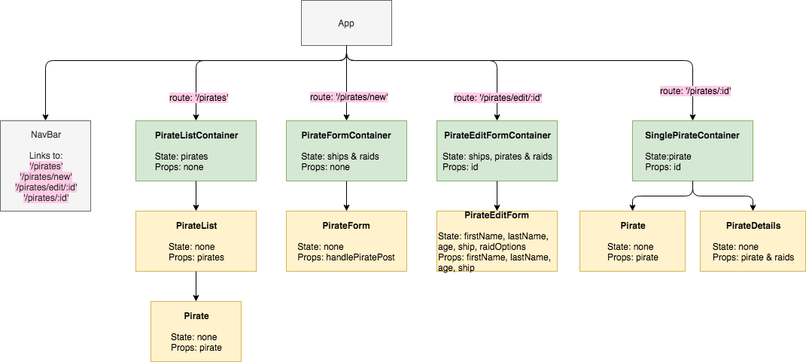

### Task 1: Draw Diagram

Draw the component diagram detailing props and state

**Answer** (similar to:)

 
### Task 2: Answer the questions
 * How do `PirateEditFormContainer` and `SinglePirateContainer` get the `id` of the selected pirate?
 	* **Answer**: In `App.js` where the Routes are setup, the routes for `PirateEditFormContainer` and `SinglePirateContainer` are setup with the `Route` render prop. This enables use of the router params in the form of `/route:id`. So `props.match.params.id` is where the id is saved and that's passed into the respective containers.
 * Where are the requests made?
 	* **Answer** the requests are all made in container components.

### Task 3: Understand and reflect on:

 * Please read: [https://coursework.vschool.io/setting-up-a-full-stack-react-application/](https://coursework.vschool.io/setting-up-a-full-stack-react-application/)
    * Look at `package.json` on the line  ` "proxy": "http://localhost:8080/"` to see where our proxy is setup.
    * Look through each request and write the full URL given what you know about the proxy
    	* **Answer**: 
    		* `/api/ships` -> `http://localhost:8080/api/ships`
    		* `/api/pirates/` -> `http://localhost:8080/api/pirates`
    		* and so on..